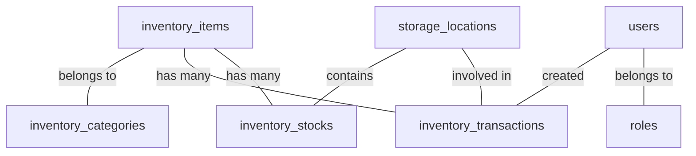

# Database Schema Map

A guide to the relationships and purposes of the tables in MerchCRM using Drizzle ORM.

## Core Tables
- **`users`**: System accounts joined with `roles`.
- **`roles`**: Defines permissions (Administrator, Sales, etc.).
- **`audit_logs`**: System activity history.

## Inventory Module
- **`inventory_categories`**: Hierarchical or list categories (e.g., "T-shirts").
- **`inventory_items`**: The items themselves. Contains "Legacy Global Stats" (id, name, sku, global quantity).
- **`storage_locations`**: Physical or logical places (e.g., "Production", "Main Warehouse").
- **`inventory_stocks`**: **THE JUNCTION**. Specifies how much of an item is at a specific location. Join of `itemId` + `storageLocationId`.
- **`inventory_transactions`**: The ledger.
    - `storage_location_id`: Target location.
    - `from_storage_location_id`: Source location (only for transfers).
    - `change_amount`: Value of change (+ or -).
- **`inventory_transfers`**: Higher-level record specifically for intra-warehouse movement.

## Relationships

## Critical Sync Points
- When updating/creating order items, inventory stocks are NOT currently auto-decreased (Manual or Task-based trigger needed).
- Global `inventory_items.quantity` should ideally match the sum of all `inventory_stocks.quantity` for that item.
