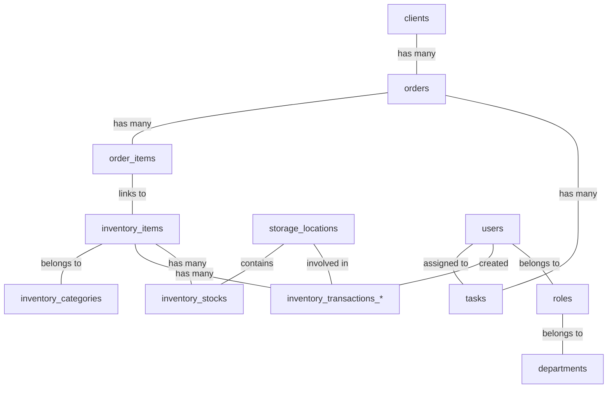

# Database Schema Map

A guide to the relationships and purposes of the tables in MerchCRM using Drizzle ORM.
This document accurately reflects the database structure defined in `drizzle/schema.ts`, including the partitioning architecture for transaction and log tables.

## 👥 Users, Roles, and Departments
- **`departments`**: Organizational units (e.g., Sales, Production).
- **`roles`**: Defines permissions and links to a specific `departmentId`.
- **`users`**: System accounts, linked to `roleId` and `departmentId`.

## 📦 Inventory Module
- **`inventory_categories`**: Hierarchical categories of items.
- **`inventory_items`**: The actual items. Contains core attributes like SKU, quantities, thresholds, pricing, archival status, and image keys.
- **`storage_locations`**: Physical or logical places (e.g., "Main Warehouse", "Production").
- **`inventory_stocks`**: **THE JUNCTION**. The real-time quantity of an item at a specific location. Join of `itemId` + `storageLocationId`.
- **`inventory_transfers`**: Higher-level record specifically for intra-warehouse movement between locations.
- **`inventory_attributes` / `inventory_attribute_types`**: Dictionaries for global custom item properties (e.g., color, size).
- **`inventory_item_attributes`**: Junction between `inventory_items` and `inventory_attributes`. 

### Inventory Transactions (Partitioned)
The ledger for all changes in stock quantities. Due to volume, these are partitioned by year:
- `inventory_transactions_default` (Fallback partition)
- `inventory_transactions_old` (Legacy unpartitioned data)
- `inventory_transactions_2025`
- `inventory_transactions_2026` ... up to 2028.
*(Columns include source location, target location, amount (+/-), and links to order/user).*

## 💼 Clients & Orders
- **`clients`**: Customer profiles (B2B / B2C), contact details, and assigned manager (`users.id`).
- **`orders`**: Client orders. Links to `clientId`, optional `promocodeId`, and has statuses (`order_status` enum).
- **`order_items`**: Junction table for order contents. Connects `orderId` to `inventory_items.id` and tracks production stage statuses (prep, print, application, packaging).
- **`order_attachments`**: Files uploaded and attached to a specific order.
- **`payments`**: Financial transactions linked to an `orderId`.

## 📋 Tasks System
- **`tasks`**: Work items containing title, statuses, and due dates. Can be linked to an `orderId` and assigned to a `userId`, `roleId`, or `departmentId`.
- **`task_history`**: Audit trail of changes made to tasks.
- **`task_checklists`**: Sub-items or steps within a task.
- **`task_comments` / `task_attachments`**: Discussion and files associated with tasks.

## 📚 Finances, Wiki & System Content
- **`promocodes`**: Available discounts applicable to orders.
- **`expenses`**: General company operating expenses.
- **`wiki_folders` / `wiki_pages`**: Built-in documentation/knowledge base system.
- **`system_settings`**: Global key/value configuration store.
- **`notifications`**: System alerts destined for specific users.

## 🔒 Security, Audit & Errors (Partitioned)
Like `inventory_transactions`, system logging tables are heavily partitioned to ensure DB performance at scale:

1. **Audit Logs** (`audit_logs_default`, `audit_logs_2025`...): Tracks entity creations, updates, and general user actions.
2. **Security Events** (`security_events_default`, `security_events_2025`...): Authentication events, log-in attempts, and permission changes.
3. **System Errors** (`system_errors_default`, `system_errors_2025`...): Backend application errors, complete with stack traces and path info.

## ⚡ Индексы (Indexing Strategy)
Для обеспечения высокой производительности в текущей схеме используется большое количество индексов, которые можно разделить на несколько ключевых типов:

1. **Индексы внешних ключей (Foreign Keys - B-Tree):** Практически все поля связей (например, `user_id`, `order_id`, `client_id`, `category_id`) имеют собственные B-Tree индексы для ускорения `JOIN` запросов.
2. **Индексы для фильтрации и поиска (B-Tree):** Поля, по которым часто происходит сортировка или фильтрация (например, `created_at`, `status`, `is_archived`, `is_active`, `type`), также проиндексированы.
3. **Составные индексы (Composite Indexes):** Используются для ускорения поиска по нескольким связанным полям одновременно. Например, в `inventory_stocks` есть индекс по `itemId` + `storageLocationId`, а в логах по `entityType` + `entityId`.
4. **Полнотекстовый поиск (GIN):** Для таблицы `inventory_items` создается GIN-индекс поверх `to_tsvector('russian'::regconfig, name)` для создания быстрого поиска по названиям товаров на русском языке (`idx_inventory_items_name_gin`).
5. **Индексы партиционированных таблиц:** В разбитых по годам таблицах (журналы аудита, транзакции, ошибки) первичные ключи состоят из `id` + `created_at`, чтобы PostgreSQL мог быстро находить нужную партицию при запросах по дате. Также в каждой партиции продублированы стандартные B-Tree индексы.

## 🔗 Core Architecture Pattern (Mermaid)

## ⚠️ Critical Sync Points
- When updating/creating order items, inventory stocks must be managed.
- The global `inventory_items.quantity` is intended to reflect the accumulated sum of `inventory_stocks.quantity` for that item across all non-system storage locations.
