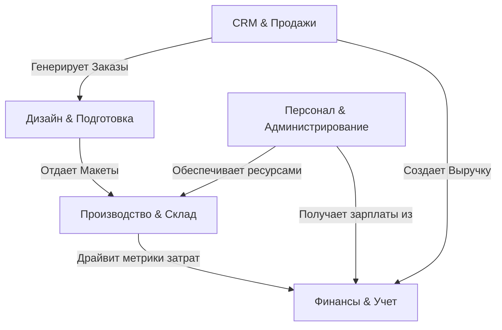

# 🏢 Бизнес-Логика Системы (MerchCRM)

## 1. Концепция и Роль (Core Concept)
`MerchCRM` — это комплексная кросс-модульная ERP/CRM-система для управления полным циклом производства брендированного кастомного мерча. Система объединяет отделы продаж, дизайна, производства, логистики и финансов в единое контролируемое цифровое пространство.

**Главные принципы бизнес-логики:**
1. **Непрерывный поток (Continuous Flow):** Жизненный цикл заказа непрерывен. Он проходит сквозь систему как конвейер — от лида и оценки до запуска в производство и финальной доставки клиенту.
2. **Абсолютная Изоляция и Иерархия:** Архитектура безопасности базируется на отделах (`Departments`) и ролях (`Roles`), обеспечивая строгую изоляцию бизнес-данных и процессов (см. [[Роли-и-Права]]). Ни одна операция не проходит без логирования (см. [[Аудит-Действий]]).
3. **Финансовая Прозрачность:** Каждое действие на производстве, складе или в закупках автоматически генерирует финансовый след (транзакцию), формируя объективный [[PnL-Отчёт]] и прозрачный баланс ([[Фонды]]).

---

## 2. Глобальная Модель Данных (Business Domains)

Система разбита на 5 ключевых доменов, взаимодействующих как часы.

---

## 3. Ключевые Процессы (Core Workflows)

### 📈 А. Цикл Продаж (Sales Funnel)
1. **Идентификация & Лидогенерация:** Создание профиля клиента и привязка к менеджерам ([[Клиенты]]).
2. **Сегментация:** Скоринг клиентов через автоматический [[RFM-Анализ]] и динамическое назначение уровня привилегий ([[Лояльность]]).
3. **Оценка и Расчет:** Автоматический расчет плановой себестоимости и маржинальности через систему калькуляторов ([[Калькулятор]]).
4. **Конверсия:** Лид переходит в статус активного заказа (`New Order`) сразу после фиксации первой входящей транзакции ([[Заказы]]).

### 🎨 Б. Расширенная Подготовка и Дизайн
1. **Очередь Дизайнов:** Спецификация заказа попадает к профильному отделу дизайна ([[Очередь-Дизайнов]]).
2. **Генерация Макетов:** Создание принта в мощном 2D-редакторе на базе Fabric.js ([[Редактор-Дизайнов]]) с моментальным рендером на 3D-мокапе для превью ([[3D-Мокапы]]).
3. **Согласование:** Утверждение макета клиентом прямо в B2B клиентском портале ([[Портал]]).

### 🏭 В. Производство, Склад и Цепочка Поставок
1. **Обеспечение Материалами:** Динамическая резервация материалов на складе по уникальным сгенерированным SKU ([[Склад]]).
2. **Распределение Станков:** Умное распределение производственных задач по машинам (плоттеры, DTF-принтеры, вышивка) с учетом их мощностей ([[Производственные-Линии]], [[Оборудование]]).
3. **Контроль Качества (QC):** Обязательный этап дефектовки после печати и пошива ([[Производство]]).
4. **Отгрузка:** Сборка партии, смена статуса на `Shipped` и автоматический трекинг логистики. Отправка триггеров в [[Уведомления]].

### 💰 Г. Финансы, PnL и Транзакции
1. **Движение Средств:** Каждая единица сырья и каждый закрытый заказ формируют транзакции поступлений/списаний. Все деньги распределяются по разным фондам ([[Транзакции]], [[Фонды]]).
2. **Анализ Рентабельности:** Реал-тайм сводка чистой маржи, себестоимости и чистой прибыли ([[PnL-Отчёт]]).
3. **Оплата Труда:** Сбор всех производственных KPI сотрудника и генерация платежной ведомости для расчета сдельной зарплаты ([[Зарплаты]]).

### 👥 Д. Администрирование, ИИ и Безопасность
1. **Мониторинг Системы:** Центральная консоль суперадмина для контроля за нагрузкой и API-лимитами ([[Мониторинг-Системы]], [[Админ-Панель]]).
2. **Организационная Структура:** Распределение сотрудников по департаментам. Учет присутствия и логирование активных часов ([[Присутствие]], [[Отделы]]).
3. **AI-Управление:** Встроенные автономные агенты (Orchestrator, Designer, Security, Planner), занимающиеся развитием и поддержанием целостности экосистемы ([[AI-Агенты]], [[AI-Лаборатория]]).

---

## 4. Словарь Жизненных Циклов (Lifecycle Dictionary)

| Сущность | Вектор Состояний (Statuses) | Парадигма |
|----------|-----------------------------|-----------|
| **Заказ** | `Lead` ➔ `Design` ➔ `Approval` ➔ `Production` ➔ `QC` ➔ `Shipped` | Принцип необратимости. Заказ двигается только вперед, с редкими отзывами на QC. |
| **Складской SKU** | `In_Stock` ➔ `Reserved` ➔ `Depleted` | Защита от кассовых и складских разрывов. Запрет продажи "в минус". |
| **Финансы** | `Pending` ➔ `Completed` ➔ `Reconciled` | Автоматическая сверка и калькуляция "ожидаемых" и "реальных" поступлений. |
| **Клиент лояльности** | `New` ➔ `Active` ➔ `VIP` ➔ `Churned` | Авто-пересчет LTV и RFM-баллов каждый месяц. |

---
[[Merch-CRM|Назад к оглавлению]]
