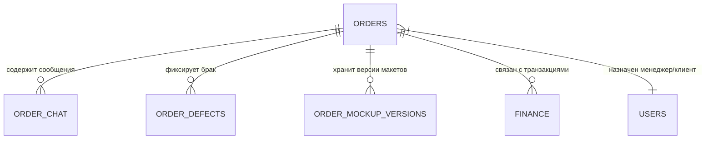

# Заказы

## 1. Описание (Goal)
Модуль «Заказы» является центральным хабом системы MerchCRM. Он предназначен для управления полным жизненным циклом заказа: от создания черновика и просчета стоимости до отгрузки клиенту и ведения истории изменений.

## 2. Связи БД (Relations)

## 3. Требования (Requirements)
- [x] Создание и редактирование заказов.
- [x] Калькуляция стоимости с учетом параметров печати.
- [ ] Интеграция с логистическими службами.
- [x] Чат внутри заказа для обсуждения деталей.
- [x] Контроль брака и допечаток.

## 4. Техническая реализация (Implementation)
> Стандарт: [[010-Стандарты/Actions|Server Actions v3.0]]

**Файлы:**
- **Схемы БД:**
  - `lib/schema/orders.ts` — Основная таблица заказов.
  - `lib/schema/order-chat.ts` — Коммуникация по заказу.
  - `lib/schema/order-defects.ts` — Учет бракованных изделий.
  - `lib/schema/order-mockup-versions.ts` — Управление версиями графических макетов.
- **Интерфейс:**
  - `app/(main)/dashboard/orders` — Основной дашборд управления заказами.

## Подзадачи
- [x] Спроектировать БД (Orders V1)
- [x] Реализовать Server Actions для создания заказов
- [x] Реализовать Чат
- [ ] Добавить массовые действия над заказами

---
[[Merch-CRM|Назад к оглавлению]]
