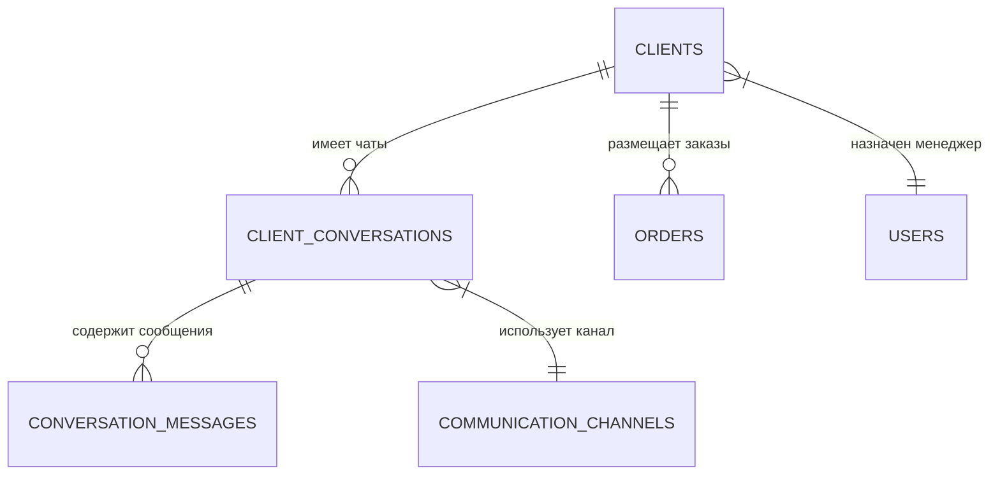

# Клиенты и Коммуникации

## 1. Описание (Goal)
Модуль «Клиенты» управляет всей базой контрагентов, их статусами, лояльностью и историей взаимодействий. Интегрированная система коммуникаций позволяет общаться с клиентами через популярные мессенджеры и соцсети в режиме «единого окна».

## 2. Связи БД (Relations)

## 3. Требования (Requirements)
- [x] Ведение базы клиентов с сегментацией (Новый, Постоянный и т.д.).
- [x] Учет причин потери клиентов (lost reasons).
- [x] Омниканальный чат (TG, IG, VK, WA, Email, SMS).
- [x] Использование шаблонов сообщений для быстрых ответов.
- [ ] Автоматические триггерные рассылки.

## 4. Техническая реализация (Implementation)
> Стандарт: [[010-Стандарты/Actions|Server Actions v3.0]]

**Файлы:**
- **Схемы БД:**
  - `lib/schema/clients/main.ts` — Основные данные клиентов, статусы, сегментация.
  - `lib/schema/communications.ts` — Каналы, диалоги, сообщения и шаблоны.
- **Интерфейс:**
  - `app/(main)/dashboard/communications` — Интерфейс омниканального чата и управления клиентами.

## Подзадачи
- [x] Реализовать единую схему коммуникаций
- [x] Интеграция с Telegram API
- [x] Система шаблонов ответов
- [ ] Интеграция с WhatsApp (Meta API)
- [ ] CRM-аналитика по клиентам (LTV, Churn rate)

---
[[Merch-CRM|Назад к оглавлению]]
