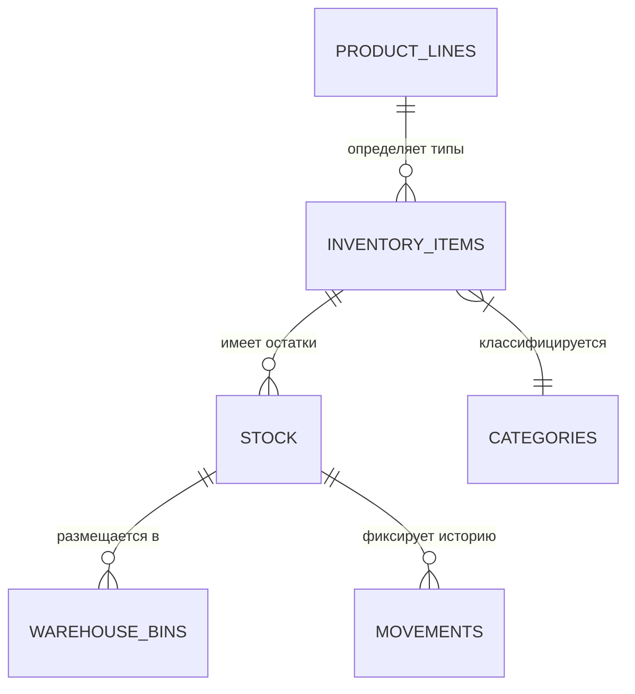

# Складской Учет

## 1. Описание (Goal)
Модуль «Склад» обеспечивает полный контроль над товарными остатками, движением ТМЦ и управлением номенклатурой. Система поддерживает адресное хранение, учет атрибутов (размер, цвет) и управление литейками продуктов.

## 2. Связи БД (Relations)

## 3. Требования (Requirements)
- [x] Иерархический справочник категорий товаров.
- [x] Гибкая система атрибутов (цвета, размеры, материалы).
- [x] Поддержка базовых и готовых линеек продуктов (Product Lines).
- [x] Автоматическое списание остатков при производстве.
- [ ] Адресное хранение (стеллажи, полки, ячейки).
- [ ] Интеграция со сканерами штрих-кодов.

## 4. Техническая реализация (Implementation)
> Стандарт: [[010-Стандарты/Actions|Server Actions v3.0]]

**Файлы:**
- **Схемы БД:**
  - `lib/schema/warehouse/categories.ts` — Категории склада.
  - `lib/schema/warehouse/items.ts` — Номенклатурные позиции.
  - `lib/schema/warehouse/stock.ts` — Текущие остатки на складах.
  - `lib/schema/warehouse/attributes.ts` — Характеристики товаров.
  - `lib/schema/product-lines.ts` — Продуктовые линейки и коллекции.
- **Интерфейс:**
  - `app/(main)/dashboard/warehouse` — Панель управления складом и остатками.

## Подзадачи
- [x] Разработать структуру хранения атрибутов (JSONB)
- [x] Реализовать импорт номенклатуры из Excel/CSV
- [ ] Внедрить систему FIFO для учета партий
- [ ] Реализовать модуль инвентаризации

---
[[Merch-CRM|Назад к оглавлению]]
