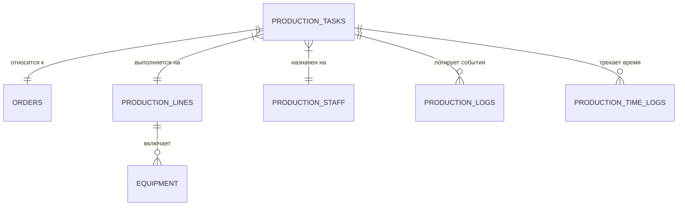

# Производство

## 1. Описание (Goal)
Модуль «Производство» управляет всеми этапами физического воплощения заказа. Он координирует работу производственных линий, распределяет задачи между сотрудниками, отслеживает состояние оборудования и контролирует время выполнения операций.

## 2. Связи БД (Relations)

## 3. Требования (Requirements)
- [x] Управление типами нанесения (печать, вышивка, гравировка и др.).
- [x] Учет и мониторинг состояния оборудования.
- [x] Очередь производственных задач с приоритетами.
- [x] Трекинг фактически затраченного времени (таймеры).
- [x] Раздельный интерфейс для координатора и сотрудников цеха.
- [ ] Автоматический расчет загрузки линий на основе KPI.

## 4. Техническая реализация (Implementation)
> Стандарт: [[010-Стандарты/Actions|Server Actions v3.0]]

**Файлы:**
- **Схемы БД:**
  - `lib/schema/production.ts` — Основная схема: задачи, оборудование, линии, сотрудники и логи времени.
  - `lib/schema/placement-items.ts` — Размещение изделий.
- **Интерфейс:**
  - `app/(main)/dashboard/production` — Панель управления производством для менеджеров/координаторов.
  - `app/(staff)` — Специализированный интерфейс для сотрудников цеха (терминал сбора данных).

## Подзадачи
- [x] Реализовать систему статусов производственных задач
- [x] Запустить модуль «Оборудование»
- [x] Внедрить систему таймеров для сотрудников
- [ ] Добавить модуль «Профилактика и ремонт» (Maintenance)
- [ ] Реализовать дашборд «Загрузка цеха» в реальном времени

---
[[Merch-CRM|Назад к оглавлению]]
