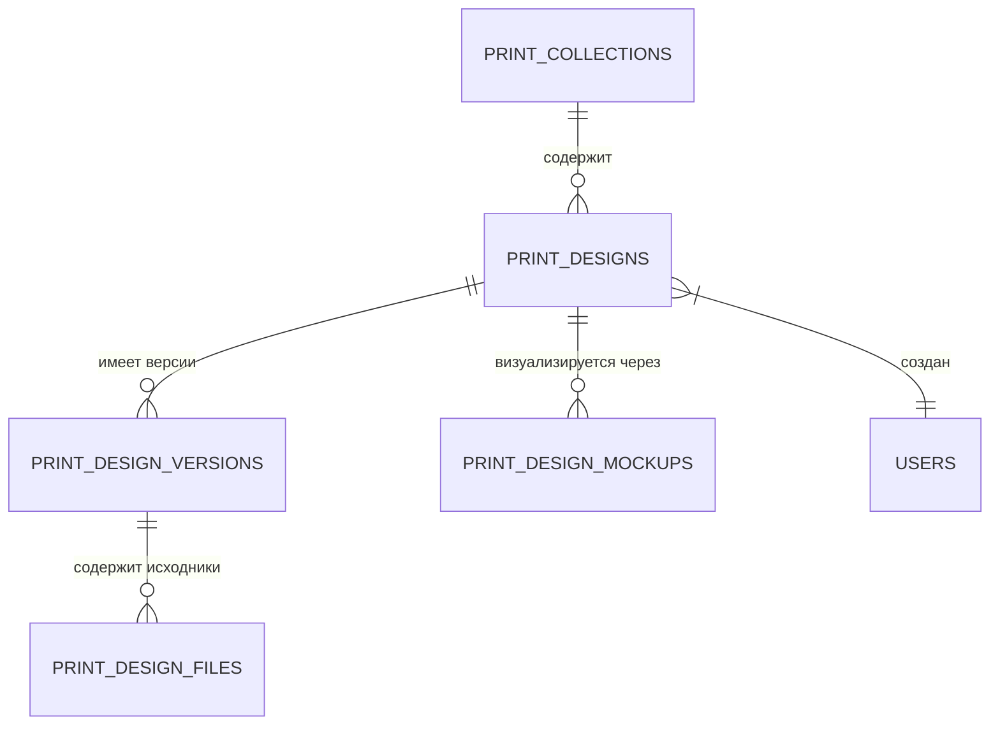

# Дизайн и Макеты

## 1. Описание (Goal)
Модуль «Дизайн» является основным хранилищем визуальных ассетов компании. Он позволяет структурировать принты по коллекциям, вести версионный контроль графических файлов и автоматически генерировать мокапы для визуализации готовой продукции.

## 2. Связи БД (Relations)

## 3. Требования (Requirements)
- [x] Организация принтов по коллекциям (сезоны, бренды).
- [x] Версионность дизайнов (хранение истории правок).
- [x] Поддержка различных форматов файлов (Vector, Raster).
- [x] Генерация и хранение мокапов (визуализация на изделиях).
- [ ] Онлайн-редактор для быстрой модификации макетов.
- [ ] Система согласования макетов с клиентом.

## 4. Техническая реализация (Implementation)
> Стандарт: [[010-Стандарты/Actions|Server Actions v3.0]]

**Файлы:**
- **Схемы БД:**
  - `lib/schema/designs.ts` — Основная логика: коллекции, принты, версии и мокапы.
  - `lib/schema/design-files.ts` — Метаданные файлов (формат, размер, разрешение).
- **Интерфейс:**
  - `app/(main)/dashboard/design` — Дизайн-студия: управление коллекциями и редактор.

## Подзадачи
- [x] Реализовать загрузку многослойных файлов (PSD/AI)
- [x] Разработать систему версионности «в один клик»
- [x] Автоматическое извлечение метаданных изображений
- [ ] Внедрить водяные знаки для превью-версий
- [ ] Реализовать 3D-предпросмотр мокапов

---
[[Merch-CRM|Назад к оглавлению]]
