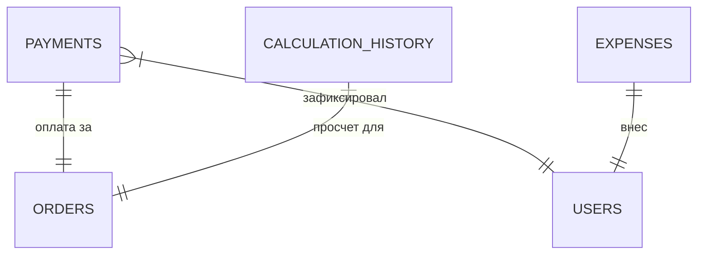

# Финансы

## 1. Описание (Goal)
Модуль «Финансы» предназначен для сквозного учета всех денежных потоков компании. Он фиксирует входящие платежи от клиентов, контролирует дебиторскую задолженность по заказам, а также позволяет вести учет операционных расходов для формирования отчета о прибылях и убытках (P&L).

## 2. Связи БД (Relations)

## 3. Требования (Requirements)
- [x] Регистрация входящих платежей (наличные, безнал, карта).
- [x] Учет авансов и окончательных расчетов.
- [x] Категоризация расходов (аренда, ФОТ, материалы, реклама).
- [x] Хранение истории калькуляций по заказам.
- [ ] Автоматическая сверка с банковскими выписками.
- [ ] Формирование налоговой отчетности.

## 4. Техническая реализация (Implementation)
> Стандарт: [[010-Стандарты/Actions|Server Actions v3.0]]

**Файлы:**
- **Схемы БД:**
  - `lib/schema/finance.ts` — Таблицы `payments` (платежи) и `expenses` (расходы).
  - `lib/schema/calculation-history.ts` — История расчетов стоимости заказов.
- **Интерфейс:**
  - `app/(main)/dashboard/finance` — Финансовый дашборд и реестры операций.

## Подзадачи
- [x] Реализовать базовый реестр платежей
- [x] Добавить модуль учета расходов по категориям
- [x] Связать оплаты с заказами для отслеживания долгов
- [ ] Разработать отчет P&L (Profit and Loss)
- [ ] Добавить поддержку мультивалютности

---
[[Merch-CRM|Назад к оглавлению]]
