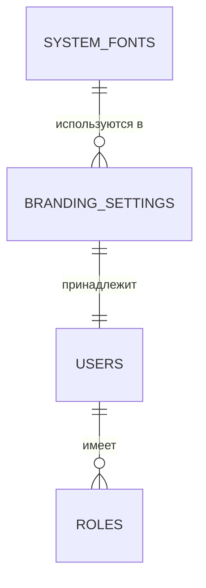

# Админ-Панель и Брендинг

## 1. Описание (Goal)
Модуль «Админ-Панель» предназначен для тонкой настройки системы под нужды конкретной компании. Он включает управление визуальным стилем (White Label) для формируемых документов (PDF-счета, накладные), управление системными шрифтами и другими глобальными параметрами MerchCRM.

## 2. Связи БД (Relations)

## 3. Требования (Requirements)
- [x] Настройка логотипа и фирменных цветов для документов.
- [x] Управление контактными данными и банковскими реквизитами компании.
- [x] Кастомизация футеров и QR-кодов в PDF.
- [x] Управление системными шрифтами для корректного отображения кириллицы.
- [ ] Управление ролями и гранулярными правами доступа (RBAC).
- [ ] Логирование действий администраторов.

## 4. Техническая реализация (Implementation)
> Стандарт: [[010-Стандарты/Actions|Server Actions v3.0]]

**Файлы:**
- **Схемы БД:**
  - `lib/schema/branding.ts` — Хранение настроек компании (White Label).
  - `lib/schema/system-fonts.ts` — Реестр доступных системных шрифтов.
- **Интерфейс:**
  - `app/(main)/dashboard/admin-panel` — Панель управления всеми системными настройками.

## Подзадачи
- [x] Реализовать предпросмотр брендинга в реальном времени
- [x] Добавить загрузку и валидацию логотипов
- [x] Интегрировать библиотеку шрифтов для генерации PDF
- [ ] Разработать редактор прав доступа для сотрудников
- [ ] Добавить поддержку нескольких филиалов/юридических лиц

---
[[Merch-CRM|Назад к оглавлению]]
