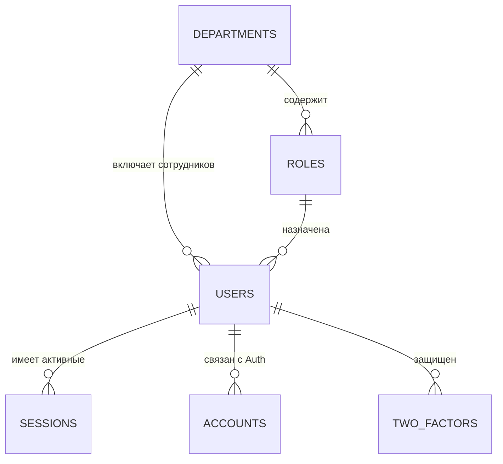

# Пользователи и Доступ

## 1. Описание (Goal)
Модуль «Пользователи» управляет кадровым составом компании, организационной структурой (отделами) и безопасностью доступа. Он обеспечивает аутентификацию, разграничение прав на основе ролей (RBAC) и мониторинг активности сотрудников.

## 2. Связи БД (Relations)

## 3. Требования (Requirements)
- [x] Иерархия отделов (Производство, Дизайн, Продажи и т.д.).
- [x] Гибкая ролевая модель с JSON-правами доступа.
- [x] Аутентификация через Better Auth (Email/Password, Socials).
- [x] Поддержка двухфакторной аутентификации (2FA).
- [x] Профили сотрудников с контактными данными и аватарами.
- [ ] Табель учета рабочего времени (Attendance).

## 4. Техническая реализация (Implementation)
> Стандарт: [[010-Стандарты/Actions|Server Actions v3.0]]

**Файлы:**
- **Схемы БД:**
  - `lib/schema/users.ts` — Центральная схема: пользователи, роли, отделы и сессии.
  - `lib/schema/presence/` — Мониторинг статуса «в сети».
- **Логика:**
  - `lib/auth.ts` — Конфигурация Better Auth и стратегий входа.
- **Интерфейс:**
  - `app/(main)/dashboard/users` — Управление персоналом и ролями.
  - `app/(auth)` — Страницы входа, регистрации и сброса пароля.

## Подзадачи
- [x] Настроить Better Auth Core
- [x] Реализовать систему департаментов
- [x] Внедрить 2FA для администраторов
- [ ] Добавить систему уведомлений о входе с нового устройства
- [ ] Реализовать визуальный конструктор прав для ролей

---
[[Merch-CRM|Назад к оглавлению]]
