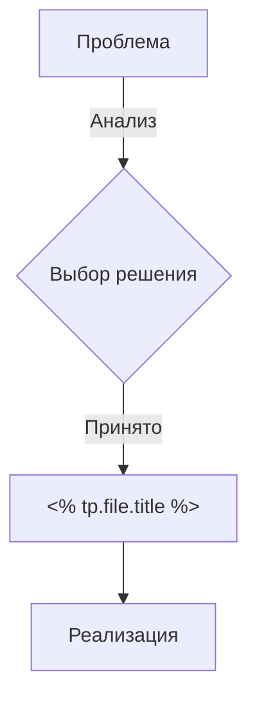

# 🏛️ Решение (ADR): <% tp.file.title %>

> [!IMPORTANT]
> Это запись архитектурного решения (Architecture Decision Record). 
> Стандарт документирования: [[010-Стандарты/Работа-с-Обсидианом|Obsidian Workflow v4.1]]

## 📝 1. Контекст (Context)
*Какую проблему мы решаем? Какие ограничения (технические, временные) на нас влияют?*

## 💡 2. Предложенное решение (Solution)
*Что именно мы выбрали и почему?*

### 📐 Архитектурная декомпозиция

## ⚖️ 3. Сравнение и Trade-offs
| Вариант | Плюсы | Минусы |
| :--- | :--- | :--- |
| **Выбранный** | [Быстро / Безопасно / Scalable] | [Сложность / Стоимость] |
| **Альтернатива А** | [Простота] | [Не масштабируется] |

## 🚀 4. Последствия (Consequences)
- [x] Плюс 1: Улучшение производительности
- [ ] Риск 1: Потребуется обновление миграций БД

## 🔗 5. Связанные ссылки
- **Модуль:** [[...]]
- **Стандарт:** [[010-Стандарты/UI-UX-Pro-Max|UI-UX Pro Max]]

---
[[020-Архитектура/ADR-Index|Реестр решений]] | [[Merch-CRM|На главную]]
