# Описание СРМ-системы

Данный документ представляет собой исчерпывающее архитектурное и функциональное описание CRM-системы полиграфической компании. Предназначен для ввода новых сотрудников в эксплуатацию системы, а также для разработчиков, проектирующих доработки и новые модули.

**Стек технологий:** Next.js 16 (App Router, Server Actions), PostgreSQL, Drizzle ORM, Fabric.js, Redis (кэширование), Better Auth (авторизация).

---

## Оглавление

1. [Глобальная архитектура системы (High-Level)](#0-глобальная-архитектура-системы-high-level)
2. [Авторизация, Пользователи и Ролевая модель](#1-авторизация-пользователи-и-ролевая-модель)
3. [Модуль: Клиенты](#2-модуль-клиенты)
4. [Модуль: Производство (Цех)](#3b-модуль-производство-цех)
5. [Модуль: Складской учет (WMS)](#4-модуль-складской-учет-wms)
6. [Модуль: Финансы](#5-модуль-финансы)
7. [Модуль: Дизайн-редактор и Библиотека принтов](#6-модуль-дизайн-редактор-и-библиотека-принтов)
8. [Модуль: Аудит, Безопасность и Системные логи](#7-модуль-аудит-безопасность-и-системные-логи)
9. [Системные модули](#8-системные-модули)
10. [Админ-панель](#8b-админ-панель)
11. [Глобальный поиск и Механизм отмены действий](#8c-глобальный-поиск-и-механизм-отмены-действий)
12. [Профиль пользователя](#8d-профиль-пользователя)
13. [Референсы (Витрина UI-компонентов)](#8e-референсы)
14. [Инфраструктура, интеграции и утилиты](#8f-инфраструктура-интеграции-и-утилиты)
15. [Безопасность и защита данных](#8g-безопасность-и-защита-данных)
16. [Справочник статусов, бейджей и цветовой индикации](#9-справочник-статусов-бейджей-и-цветовой-индикации)
17. [Архитектура Базы Данных (Drizzle ORM)](#10-архитектура-базы-данных-drizzle-orm)
18. [Каталог сервисных скриптов](#11-каталог-сервисных-скриптов)
19. [Схемы взаимодействия (Cross-Module Workflows)](#12-схемы-взаимодействия-cross-module-workflows)

---

## 0. Глобальная архитектура системы (High-Level)

Ниже представлена общая карта проекта, показывающая, как основные блоки взаимодействуют между собой. Каждое действие в одном модуле (например, в Заказах) автоматически вызывает изменения в связанных (Склад, Финансы).

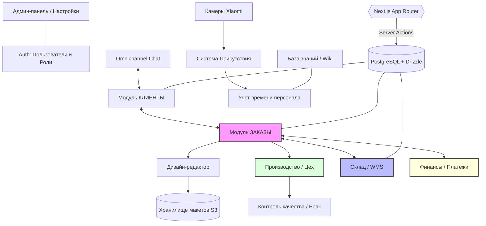

---

## 1. Авторизация, Пользователи и Ролевая модель

### 1.1 Структура данных

Система использует трёхуровневую иерархию доступа.

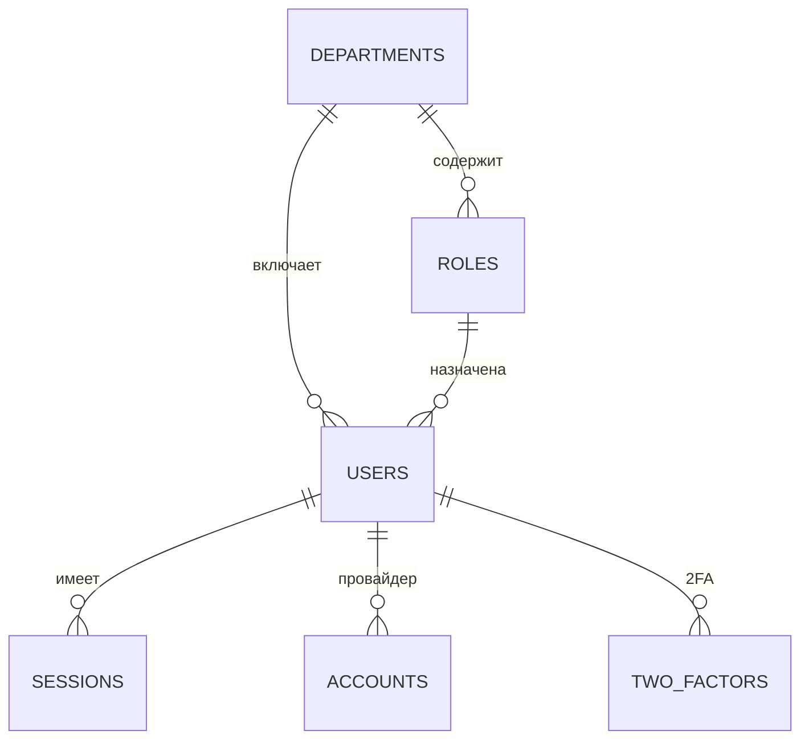

- **Отделы (`departments`)**: Логические бизнес-единицы (Производство, Отдел продаж, Дизайн). Поля: `name` (уникальное), `color`, `isActive`, `isSystem`.
- **Роли (`roles`)**: Связаны с отделом. Содержат JSON-объект `permissions`, определяющий доступ к страницам и действиям.
- **Пользователи (`users`)**: Каждый сотрудник привязан к одной роли и одному отделу. Содержат: `name`, `email` (уникальный), `phone`, `birthday`, `avatar`, `telegram`, `instagram`, `socialMax`, `lastActiveAt`, `twoFactorEnabled`.

### 1.2 Авторизация (Better Auth)

- **Сессии (`sessions`)**: Хранят `token`, `userId`, `userAgent`, `ipAddress`, `expiresAt`. При удалении пользователя сессии каскадно удаляются.
- **Аккаунты (`accounts`)**: Поддержка внешних OAuth-провайдеров (`providerId`, `accessToken`, `refreshToken`). Пароль хранится в поле `password` (хэш).
- **Двухфакторная аутентификация (`two_factors`)**: Хранит `secret` (TOTP) и `backupCodes`.
- **Токены верификации (`verification_tokens`)**: Для подтверждения email и сброса пароля.

### 1.3 Ограничения доступа (Серверные действия)

Каждое серверное действие (Server Action) начинается с проверки `getSession()`. Для проверки прав доступа **обязательно** используются централизованные утилиты из `@/lib/roles`:

```typescript
import { isAdmin } from "@/lib/roles";

export async function someAction() {
    const session = await getSession();
    const isAllowed = isAdmin(session?.roleName) || ["Склад"].includes(session?.roleName || "");
    
    if (!session || !isAllowed) {
        return { success: false, error: "Недостаточно прав" };
    }
    // ...
}
```

- **Администратор / Руководство** (`isAdmin`): Полный доступ ко всем модулям.
- **Отдел продаж**: Управление клиентами и заказами, но не удаление.
- **Дизайнер / Печатник**: Ограниченный доступ, скрытие номеров телефонов клиентов (`phone: "HIDDEN"`).
- **Склад**: Управление товарами и остатками.

---

## 2. Модуль: Клиенты

### 2.1 Структура данных клиента

Клиент (`clients`) хранит расширенный профиль с денормализованной статистикой для быстрого доступа.

**Основные поля:** `lastName`, `firstName`, `patronymic`, `clientType` (B2B/B2C), `company`, `phone`, `telegram`, `instagram`, `email`, `city`, `address`, `comments`, `socialLink`, `acquisitionSource`, `managerId`.

**Денормализованная статистика (обновляется автоматически):**
- `totalOrdersCount` — Количество заказов.
- `totalOrdersAmount` — Общая сумма заказов (LTV).
- `averageCheck` — Средний чек.
- `lastOrderAt` / `firstOrderAt` — Даты первого и последнего заказа.
- `daysSinceLastOrder` — Дни с последнего заказа (для определения активности).

### 2.2 Серверные действия (Server Actions)

#### Мутации (`mutations.ts`)
| Действие | Функция | Доступ | Описание |
|---|---|---|---|
| Создание клиента | `addClient()` | Администратор, Руководство, Отдел продаж | Валидация через Zod (`ClientSchema`). Перед созданием система **проверяет дубликаты** по телефону, email, ФИО (функция `checkClientDuplicates`). Если найдены дубли и `ignoreDuplicates` = false, возвращает список найденных совпадений для подтверждения. Операция выполняется в **транзакции** с записью в аудит-лог. Инвалидирует кэш Redis `clients:*`. |
| Обновление клиента | `updateClient()` | Администратор, Руководство, Отдел продаж | Обновляет все поля клиента. Автоматически формирует `name` из `lastName + firstName + patronymic`. |
| Удаление клиента | `deleteClient()` | **Только Администратор** | Удаляет клиента **вместе со всеми его заказами**. Перед удалением заказов вызывает `releaseReservationsForOrders()` для снятия всех резервов со склада. |
| Обновление поля | `updateClientField()` | Администратор, Руководство, Отдел продаж | Точечное обновление одного поля (inline editing в UI). |
| Архивация | `toggleClientArchived()` | Администратор, Руководство, Отдел продаж | Мягкое удаление — клиент перемещается в архив без потери данных. |
| Комментарии | `updateClientComments()` | Администратор, Руководство, Отдел продаж | Обновление текстового поля комментариев. |

#### Запросы (`queries.ts`)
| Функция | Описание |
|---|---|
| `getClients()` | Основной запрос списка клиентов. Поддерживает **13 параметров фильтрации**: поиск (по ФИО, телефону, email, компании), тип клиента, менеджер, регион, источник привлечения, статус активности (active/attention/at_risk/inactive), уровень лояльности, RFM-сегмент, диапазон суммы заказов. Пагинация, 4 варианта сортировки. |
| `getClientDetails()` | Полный профиль клиента с историей заказов (до 100), статистикой платежей, историей действий из аудит-лога (до 20 последних). Рассчитывает баланс (оплачено − начислено). |
| `getClientStats()` | Агрегированная статистика: всего клиентов, новых за месяц, средний чек, общая выручка, среднее LTV. |
| `getClientTypeCounts()` | Счётчики по типам: всего, B2C, B2B. |
| `getClientsInitialData()` | Пакетная загрузка всех данных для страницы (клиенты + менеджеры + регионы + источники + счётчики типов + счётчики активности) через `Promise.all`. |
| `getAcquisitionSources()` | Уникальные источники привлечения из базы (для фильтра). Кэшируется в Redis. |
| `getManagers()` | Список менеджеров для фильтра/назначения. Кэшируется в Redis. |
| `getRegions()` | Уникальные города из базы. Кэшируется в Redis. |

### 2.3 Воронка продаж (`funnel.actions.ts`)

Пятиступенчатая воронка с Drag & Drop перемещением клиентов между этапами.

| Этап | Код | Цвет | Описание |
|---|---|---|---|
| Лид | `lead` | `#64748B` (Серый) | Потенциальный клиент, контакт еще не установлен. |
| Первый контакт | `first_contact` | `#3B82F6` (Синий) | Менеджер связался с клиентом. |
| Переговоры | `negotiation` | `#F59E0B` (Оранжевый) | Обсуждение условий, подготовка КП. |
| Первый заказ | `first_order` | `#10B981` (Зеленый) | Клиент разместил первый заказ. |
| Постоянный | `regular` | `#6366F1` (Фиолетовый) | Клиент стал постоянным. |

**Серверные действия воронки:**
- `getClientsForFunnel()` — Получает клиентов не в архиве и не потерянных.
- `getFunnelStats()` — Агрегированная статистика: количество и сумма по каждому этапу.
- `updateClientFunnelStage()` — Перемещение клиента на новый этап (с записью даты перехода `funnelStageChangedAt`).
- `markClientAsLost()` — Отметка клиента как потерянного: фиксируется причина (`lostReason`), комментарий добавляется в поле `comments`, клиент автоматически архивируется.

**Причины потери клиента (`lostReasons`):** Не устроила цена, Ушёл к конкуренту, Не устроило качество, Не устроили сроки, Отпала потребность, Не выходит на связь, Другое.

### 2.4 RFM-анализ и Аналитика

Система автоматически рассчитывает RFM-сегменты клиентов:
- `rfmRecency` (R) — Давность последней покупки.
- `rfmFrequency` (F) — Частота заказов.
- `rfmMonetary` (M) — Объем покупок.
- `rfmScore` — Составной балл (например, "555").
- `rfmSegment` — Текстовый сегмент (например, "Чемпионы", "Под угрозой").

**Страница аналитики** (`/dashboard/clients/analytics`) содержит:
- График роста клиентской базы (`client-growth-chart`)
- Распределение по источникам привлечения (`acquisition-sources-chart`)
- Воронка продаж в виде графика (`funnel-chart`)
- Распределение RFM-сегментов (`rfm-distribution-chart`)
- Эффективность менеджеров (`manager-performance-card`)
- Таблица топ-клиентов по выручке (`top-clients-table`)

### 2.5 Система лояльности

Управляется на странице `/dashboard/clients/analytics/loyalty`. Клиенту присваивается `loyaltyLevelId` автоматически (на основе суммы заказов) или вручную (`loyaltyLevelSetManually`).

**Уровни лояльности (`loyalty_levels`):**
- `levelKey` — Уникальный ключ уровня (например, `bronze`, `silver`, `gold`).
- `levelName` — Отображаемое название.
- `minOrdersAmount` — Минимальная сумма заказов для достижения уровня.
- `minOrdersCount` — Минимальное количество заказов.
- `discountPercent` — Автоматическая скидка для клиентов этого уровня.
- `bonusDescription` — Текстовое описание привилегий.
- `color` / `icon` / `priority` — Визуальные настройки бейджа.

### 2.6 Статусы активности клиентов

На основе поля `daysSinceLastOrder` клиенты классифицируются:
- **Активный** — Последний заказ < 60 дней назад (или новый клиент < 60 дней).
- **Внимание** — 60–90 дней без заказа.
- **Под угрозой** — 90–180 дней без заказа.
- **Неактивный** — > 180 дней без заказа.

UI-компонент `at-risk-banner` отображает предупреждение для клиентов в зоне риска.

### 2.7 Контакты клиента B2B (`client_contacts`)

Для B2B-клиентов поддерживается множество контактных лиц, привязанных к одному клиенту.

| Поле | Описание |
|---|---|
| `name` | ФИО контактного лица. |
| `position` | Должность. |
| `role` | Роль: `lpr` (ЛПР — лицо принимающее решение), `accountant` (Бухгалтер), `buyer` (Закупщик), `other`. |
| `phone` / `email` / `telegram` | Контактные данные. |
| `isPrimary` | Флаг основного контакта. |
| `notes` | Заметки по контактному лицу. |

### 2.8 Брендинг клиента B2B (`client_branding`)

Хранение брендинг-материалов клиентов (логотипы, шрифты, паттерны) для повторного использования при создании макетов.

- `clientId` — Привязка к клиенту.
- `fileType` — Тип файла: `logo_main`, `logo_accent`, `icon`, `font`, `pattern`, `other`.
- `fileName` / `filePath` / `fileSize` / `mimeType` — Информация о файле.
- `description` — Описание (например, «Логотип для тёмного фона»).
- `sortOrder` — Порядок отображения.

---

## 3. Модуль: Заказы и Производство

### 3.1 Структура данных заказа

Заказ (`orders`) — центральная сущность системы, связывающая клиента, производство, склад и финансы.

**Основные поля:** `orderNumber` (уникальный, формат `ORD-YY-NNNN`), `clientId`, `status`, `totalAmount`, `paidAmount`, `paymentStatus`, `priority` (normal/high/low), `isUrgent`, `deadline`, `managerId`, `createdBy`, `source`, `category` (print/embroidery/merch/other), `promocodeId`, `discountAmount`, `cancelReason`, `isArchived`.

**Доставка:** `deliveryStatus`, `shippingAddress`, `deliveryMethod`, `deliveryTrackingNumber`, `estimatedDeliveryDate`, `actualDeliveryDate`.

### 3.2 Позиции заказа (`order_items`)

Каждая позиция привязана к конкретному товару со склада (`inventoryId`) и проходит **4 производственные стадии**:
- `stagePrepStatus` — Подготовка.
- `stagePrintStatus` — Печать.
- `stageApplicationStatus` — Нанесение.
- `stagePackagingStatus` — Упаковка.

Каждая стадия имеет значения: `pending` → `in_progress` → `done` / `failed`.

### 3.3 Жизненный цикл заказа (Статусная машина)

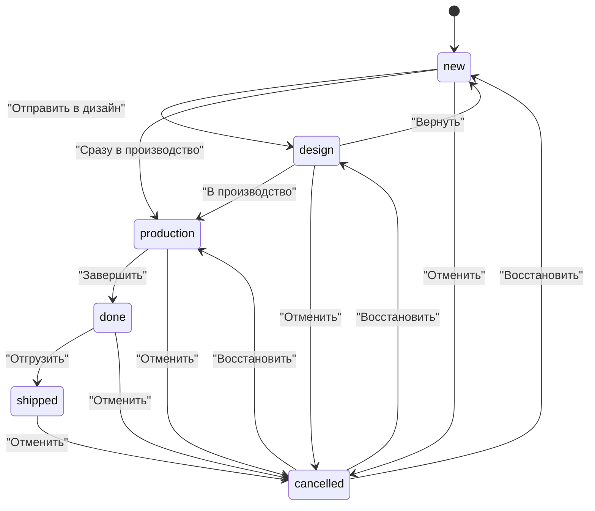

**Правила переходов:**
- Администратор / Руководство — могут совершить **любой** переход.
- Остальные роли — только по разрешённым переходам из таблицы `allowedTransitions`.

### 3.4 Серверные действия заказов

#### `createOrder()` — Создание заказа
Выполняется в транзакции. Последовательность операций:
1. Генерация уникального номера `ORD-YY-NNNN` (инкрементально от последнего заказа).
2. Создание записи заказа.
3. Для каждой позиции: вставка `order_item`, **резервирование товара на складе** (`reservedQuantity += quantity`). Если товара недостаточно — транзакция откатывается с ошибкой.
4. Если указан промокод — расчёт скидки (процентная или фиксированная), инкремент `usageCount` промокоду.
5. Если есть предоплата — автоматическое создание платежа (`payments`).
6. Отправка уведомления всем сотрудникам через `sendStaffNotifications()`.
7. Запись в аудит-лог.

#### `updateOrderStatus()` — Смена статуса
Критическое серверное действие с автоматическими побочными эффектами:

| Переход | Автоматическое действие |
|---|---|
| `* → done` или `* → shipped` | **Списание со склада**: `quantity -= qty`, `reservedQuantity -= qty`. Создание складской транзакции типа `out` с привязкой к заказу. Выбор лучшего складского расположения. |
| `* → cancelled` (если статус был `new`, `design`, `production`) | **Снятие резервов**: `reservedQuantity -= qty` для всех позиций через `releaseOrderReservation()`. |
| Любой переход | Запись аудит-лога с `from` и `to`. Вызов `autoGenerateTasks()` для автоматического создания задач. |

#### Остальные действия
| Функция | Описание |
|---|---|
| `getOrders()` | Список заказов с фильтрацией (дата, поиск, архив), пагинацией. Включает связанные данные: клиент, позиции, создатель, вложения. |
| `getOrderById()` | Полная карточка заказа со всеми связями (клиент, позиции, создатель, вложения, платежи, промокод). |
| `archiveOrder()` | Мягкое удаление. Только Администратор / Руководство. |
| `deleteOrder()` | Жёсткое удаление с предварительным снятием резервов (если заказ не отгружен). Только Администратор / Руководство. |
| `updateOrderField()` | Inline-редактирование полей: `isUrgent`, `priority`, `deadline`, `status`. |
| `updateOrderPriority()` | Изменение приоритета. Только Администратор, Руководство, Отдел продаж. |
| `getOrderStats()` | Агрегированная статистика: всего, новых, в производстве, завершённых, выручка. |

### 3.5 Вложения к заказам (`order_attachments`)

Файлы (макеты, ТЗ, фотографии) прикрепляются к заказу. Поля: `fileName`, `fileKey`, `fileUrl`, `fileSize`, `contentType`, `createdBy`.

### 3.6 UI-компоненты страницы заказов

- **Дашборд** (`orders-dashboard-client.tsx`): Виджеты со статистикой (`orders-widgets.tsx`), таблица заказов с inline-редактированием статусов.
- **Бейджи статусов** (`status-badge.tsx`, `status-badge-interactive.tsx`): Визуальная индикация + возможность смены статуса прямо из таблицы.
- **Бейджи приоритетов** (`priority-badge.tsx`, `priority-badge-interactive.tsx`): Аналогично, с dropdown-выбором.
- **Создание заказа** (`/orders/new`): Пошаговый wizard из 4 шагов: Выбор клиента (`StepClientSelection`) → Выбор товаров (`StepItemSelection`) → Детали заказа (`StepOrderDetails`) → Подтверждение (`StepConfirmation`).
- **Массовые действия** (`bulk-actions-panel.tsx`): Групповое изменение статуса, архивация.
- **Фильтр по дате** (`date-range-filter.tsx`): Выбор диапазона дат.
- **Карточка заказа** (`/orders/[id]/page.tsx`): Полная информация, таблица позиций с производственными стадиями, кнопки добавления платежа, вложений, возврата.

---

## 4. Модуль: Складской учет (WMS)

### 4.1 Структура данных

**Товары (`inventory_items`):**
- Основная информация: `name`, `sku` (уникальный артикул), `itemType` (clothing/packaging/consumables), `description`.
- Остатки: `quantity` (фактические), `reservedQuantity` (зарезервировано заказами), `lowStockThreshold` (порог предупреждения), `criticalStockThreshold` (критический порог).
- Цены: `costPrice` (себестоимость), `sellingPrice` (цена продажи).
- Медиа: `image`, `imageBack`, `imageSide`, `thumbnailSettings`, `imageDetails`.
- Производственная линейка: `productLineId`, `baseItemId`, `printDesignId`, `printVersionId`.
- Атрибуты: `qualityCode`, `materialCode`, `brandCode`, `attributeCode`, `sizeCode`, `attributes` (JSON), `materialComposition` (JSON).
- Архивирование: `isArchived`, `archivedAt`, `archivedBy`, `archiveReason`, `zeroStockSince`.

**Категории (`inventory_categories`):** Иерархическая структура товаров с иконками и цветами.

**Атрибуты (`inventory_attributes`, `inventory_attribute_types`):** Характеристики товаров (размер, цвет, материал). Управляются через отдельный интерфейс `/warehouse/characteristics`.

**Складские расположения (`storage_locations`):** Тип (`warehouse`, `production`, `office`).

**Складские остатки (`inventory_stocks`):** Остатки привязаны к конкретному расположению.

### 4.2 Транзакции склада (`inventory_transactions`)

Любое движение товара фиксируется как транзакция:

| Тип | Код | Описание |
|---|---|---|
| Приход | `in` / `stock_in` | Поступление от поставщика. |
| Расход | `out` / `stock_out` | Списание (продажа, отгрузка). |
| Перемещение | `transfer` | Перемещение между складскими расположениями. |
| Корректировка | `adjustment` | Результат инвентаризации. |
| Изменение атрибута | `attribute_change` | Изменение характеристик товара. |
| Архивация | `archive` | Перемещение в архив. |
| Восстановление | `restore` | Восстановление из архива. |

### 4.3 SKU-генератор

Модуль автоматической генерации артикулов (`sku-generator.ts`) на основе кодов: качества, материала, бренда, атрибутов и размера.

### 4.4 UI-компоненты склада

- **Главная страница** (`/warehouse`): Навигация по вкладкам (`WarehouseNavigationTabs`), обзор статистики (`StatsOverview`), уведомления об остатках (`StockAlerts`), финансовая аналитика (`FinancialBento`), аналитика оборота (`InventoryAnalytics`), тренды активности (`ActivityTrend`).
- **Категории** (`/warehouse/categories`): Сортируемые карточки категорий (`SortableCategoryCard`), дрилл-даун в категорию (`/categories/[id]`) с фильтрацией, массовыми действиями и миниатюрами товаров.
- **Характеристики** (`/warehouse/characteristics`): Управление типами атрибутов.
- **Архив** (`/warehouse/archive`): Архивированные товары.
- **Диалоги**: Корректировка остатков (`adjust-stock-dialog`), добавление категории, складского расположения, типа атрибута, печать этикеток (`LabelPrinterDialog`).

---

## 5. Модуль: Финансы

Доступ: **только Администратор и Руководство**.

### 5.1 Платежи (`payments`)

Привязаны к заказу (`orderId`). Поддерживают частичные оплаты и предоплаты (`isAdvance`).

| Поле | Значения |
|---|---|
| Метод оплаты (`method`) | `cash` (Наличные), `bank` (Банковский перевод), `online` (Онлайн-оплата), `account` (Расчётный счёт) |
| Статус (`status`) | `completed`, `pending`, `cancelled` |

### 5.2 Расходы (`expenses`)

| Категория | Код | Описание |
|---|---|---|
| Аренда | `rent` | Оплата аренды помещений. |
| Зарплата | `salary` | Фонд оплаты труда. |
| Закупки | `purchase` | Закупка материалов и сырья. |
| Налоги | `tax` | Налоговые платежи. |
| Прочее | `other` | Прочие расходы. |

### 5.3 Серверные действия финансов

| Функция | Описание |
|---|---|
| `getFinancialStats()` | Комплексная финансовая сводка: выручка, количество заказов, средний чек, чистая прибыль (с вычетом себестоимости из складских списаний). График выручки по дням. Разбивка по категориям заказов. |
| `getSalaryStats()` | Расчёт ФОТ: базовая ставка 30 000₽ + бонус 500₽ за каждый завершённый заказ. Группировка по сотрудникам с указанием роли и отдела. |
| `getFundsStats()` | Распределение выручки по фондам: Операционный (40%), ФОТ (30%), Развитие (15%), Резерв (10%), Маркетинг (5%). |
| `getPLReport()` | Отчёт о прибылях и убытках (P&L): Выручка (сумма платежей) − Себестоимость (COGS из складских списаний) = Валовая прибыль − Накладные расходы (сумма expenses) = Чистая прибыль. Рассчитывает маржинальность. |
| `getFinanceTransactions()` | Список всех платежей или расходов за период. |
| `createExpense()` | Создание записи о расходе с аудит-логом. |
| `validatePromocode()` | Валидация промокода: проверка активности, лимитов использования, расчёт скидки (процентная или фиксированная). |

### 5.4 UI-страницы финансов

Страница `/dashboard/finance` с вкладками:
- **Продажи** (`sales-client.tsx`): Графики выручки и заказов.
- **Расходы** (`expenses-client.tsx`): Таблица расходов с фильтрацией по категориям, создание нового расхода.
- **Зарплаты** (`salary-client.tsx`): Таблица расчёта ФОТ по сотрудникам.
- **Фонды** (`funds-client.tsx`): Визуализация распределения выручки.
- **P&L** (`pl-client.tsx`): Отчёт о прибылях и убытках.
- **Транзакции** (`transactions-client.tsx`): Журнал всех финансовых операций.

---

## 6. Модуль: Дизайн-редактор и Библиотека принтов

### 6.1 Библиотека принтов

**Коллекции (`print_collections`):** Логическая группировка дизайнов по темам (например, "Новогодняя коллекция", "Спортивная серия").

**Дизайны (`print_designs`):** Конкретный принт с превью, привязанный к коллекции. Имеет версии (`print_design_versions`) для отслеживания итераций.

**Типы нанесения (`application_types`):** Какие техники нанесения доступны (DTF, вышивка, шелкография). Имеют `color` для визуальной индикации в UI.

### 6.2 Очередь дизайн-задач (`order_design_tasks`)

Отдельная система задач привязанная к заказам для управления дизайнерским процессом.

**Статусы задач дизайна:**
- `pending` — В очереди.
- `in_progress` — Дизайнер работает.
- `review` — На рассмотрении (ожидание утверждения).
- `approved` — Утверждена.
- `not_required` — Не требуется (для позиций без дизайна).

**Серверные действия дашборда дизайна (`design-dashboard-actions.ts`):**
| Функция | Описание |
|---|---|
| `getDesignStats()` | Статистика: в очереди, в работе, на рассмотрении, завершено сегодня/на неделе, просрочено, среднее время выполнения (в минутах), всего дизайнов, всего коллекций. |
| `getMyDesignTasks()` | Задачи конкретного дизайнера (или все, если userId не указан). |
| `getUrgentDesignTasks()` | Задачи со сроком до завтра включительно. |
| `getRecentCompletedTasks()` | Последние 5 утверждённых задач. |
| `getPopularDesigns()` | Самые используемые дизайны с количеством применений. |
| `getApplicationTypesStats()` | Статистика по типам нанесения с процентным соотношением. |

### 6.3 Визуальный редактор (Fabric.js)

Встроенный графический редактор для подготовки макетов. Архитектура построена на паттерне **Command** с тремя менеджерами.

**Класс `Editor`** — главный фасад:
- Инициализация Canvas (Fabric.js).
- Делегирование операций менеджерам.
- Событийная модель (`EventEmitter`).

**`ObjectManager`** — Управление объектами на холсте:
- `addImage(url, options)` — Добавление изображения с автомасштабированием и центрированием. Лимит слоёв (`maxLayers`).
- `addText(text, styles)` — Добавление текстового блока через `Textbox` (шрифт, размер, цвет, выравнивание, межбуквенный интервал, межстрочный интервал, подчёркивание, зачёркивание).
- `removeObject(id)` — Удаление с записью в историю.
- `getLayers()` — Список слоёв (сверху вниз, исключая watermark).
- Управление Z-Index: `bringForward`, `sendBackward`, `bringToFront`, `sendToBack`.
- Выделение: `selectObject`, `deselectAll`, `getSelectedObjects`.

**`StyleManager`** — Управление стилями:
- Позиция, масштаб, вращение, прозрачность.
- Отражение (горизонтальное/вертикальное).
- Текстовые стили (шрифт, размер, жирность, курсив, цвет, выравнивание).
- Фильтры изображений (apply/remove).
- Водяные знаки (Watermark): включение/выключение и настройка.

**`ExportManager`** — Экспорт и масштабирование:
- Zoom: `setZoom`, `zoomIn`, `zoomOut`, `resetZoom`, `fitToScreen`.
- Экспорт: `exportImage(options)` — генерация PNG/JPEG с заданными параметрами.
- Сериализация: `toJSON()` / `loadFromJSON()` — сохранение и восстановление состояния холста.

**`HistoryManager`** — Undo/Redo:
- Каждое действие (добавление, удаление, перемещение) оборачивается в команду (`AddObjectCommand`, `RemoveObjectCommand`).
- Команды хранятся в стеке. `undo()` / `redo()` отменяют и повторяют операции.
- Событие `history:changed` эмитится при каждом изменении для обновления UI.

### 6.4 UI-страницы дизайна

- **Дашборд** (`/dashboard/design`): Виджеты статистики, очередь задач, срочные задачи, популярные дизайны.
- **Очередь** (`/dashboard/design/queue`): Список всех дизайн-задач по заказам.
- **Коллекции принтов** (`/dashboard/design/prints`): Библиотека дизайнов по коллекциям с превью.
- **Редактор** (`/dashboard/design/editor`): Полноэкранный графический редактор.

### 6.5 Проекты редактора (`editor_projects`)

Сохранение состояния холста в базу данных для последующего открытия и редактирования.

| Поле | Описание |
|---|---|
| `orderId` / `orderItemId` | Привязка к заказу и позиции (опционально). |
| `designId` | Привязка к дизайну из библиотеки (опционально). |
| `name` / `description` | Название и описание проекта. |
| `width` / `height` | Размеры холста (default: 800×600). |
| `canvasData` | JSON-сериализация состояния Fabric.js. |
| `thumbnailPath` | Путь к превью. |
| `isTemplate` | Шаблон для повторного использования. |
| `isFinalized` | Финальная версия (заблокирована для редактирования). |

**Экспорты (`editor_exports`):** Каждый экспорт из проекта фиксируется: `format` (PNG/JPEG/SVG/PDF), `width`/`height`, `size` (байты), `hasWatermark`, `quality` (для JPEG).

### 6.6 Системные шрифты (`system_fonts`)

Управление шрифтами, доступными в графическом редакторе.

- `name` / `family` — Отображаемое имя и CSS font-family (уникальный).
- `regularPath` / `boldPath` / `italicPath` / `boldItalicPath` — Пути к файлам начертаний.
- `category` — Категория: `serif`, `sans-serif`, `display`, `handwriting`, `monospace`.
- `isSystem` — Системный шрифт (не может быть удалён).
- `sortOrder` — Порядок в списке.

---

## 6a. Главный дашборд

Страница `/dashboard`. Отображает агрегированную статистику по всей системе.

### Серверные действия (`dashboard/actions.ts`)

| Функция | Описание |
|---|---|
| `getDashboardStatsByPeriod()` | Статистика за период: `today`, `week`, `month`, `quarter`, `all`. Возвращает: всего клиентов, новых, заказов, в производстве, выручку (форматированную с `K`/`M`), средний чек. |
| `getDashboardStats()` | Базовая агрегация: COUNT(clients), COUNT(orders), COUNT(in production), SUM(totalAmount). Использует настройки брендинга для символа валюты. |
| `getDashboardNotifications()` | Последние уведомления текущего пользователя (до 5). |

### UI-компоненты

`dashboard-client.tsx` (17 КБ) — основной клиентский компонент. Включает:
- Виджеты с метриками (клиенты, заказы, выручка, средний чек).
- Фильтр периода (сегодня / неделя / месяц / квартал / всё время).
- Лента последних уведомлений.

---

## 7. Модуль: Аудит, Безопасность и Системные логи

### 7.1 Аудит-логи (`audit_logs`)

Записывается **каждое бизнес-действие** в системе. Таблица партиционирована по годам (`audit_logs_2026`, `audit_logs_old`).

**Структура записи:**
- `userId` — Кто совершил действие.
- `action` — Текстовое описание (например, "Создан заказ", "Обновлен статус", "Архивация клиента").
- `actionCategory` — Категория действия для фильтрации.
- `entityType` — Тип сущности (`order`, `client`, `inventory_item`, `expense`, ...).
- `entityId` — ID затронутой сущности.
- `details` — JSON-объект со снэпшотом данных "до/после". Позволяет восстановить изменённые данные.
- `createdAt` — Временная метка.

**Какие действия логируются:**
- Клиенты: создание, обновление, удаление, архивация, изменение полей, обновление комментариев, смена этапа воронки, отметка как потерянный.
- Заказы: создание, смена статуса (с указанием `from` и `to`), изменение полей, архивация, удаление, смена приоритета.
- Склад: все транзакции (приход, списание, корректировка, перемещение).
- Финансы: создание расходов.

### 7.2 События безопасности (`security_events`)

Партиционированная таблица (составной PK: `id + createdAt`).

| Тип события | Код | Описание |
|---|---|---|
| Успешный вход | `login_success` | Фиксация IP, User-Agent. |
| Неудачный вход | `login_failed` | Попытка входа с неверными данными. |
| Выход | `logout` | Завершение сессии. |
| Смена пароля | `password_change` | Изменение собственного пароля. |
| Запрос сброса пароля | `password_reset_requested` | Запрос восстановления. |
| Смена email | `email_change` | Изменение адреса электронной почты. |
| Обновление профиля | `profile_update` | Редактирование данных профиля. |
| Смена роли | `role_change` | Изменение роли пользователя. |
| Изменение прав | `permission_change` | Редактирование JSON-объекта permissions роли. |
| Экспорт данных | `data_export` | Попытка выгрузки базы. |
| Удаление записи | `record_delete` | Жёсткое удаление любой сущности. |
| Изменение настроек | `settings_change` | Системные настройки. |
| Режим обслуживания | `maintenance_mode_toggle` | Включение/выключение режима обслуживания. |
| Системная ошибка | `system_error` | Критический сбой. |
| Превышение лимита запросов | `rate_limit_exceeded` | Rate limiting. |
| Имперсонация (начало) | `admin_impersonation_start` | Администратор вошёл под учётной записью другого пользователя. |
| Имперсонация (конец) | `admin_impersonation_stop` | Завершение имперсонации. |

**Уровни severity:** `info`, `warning`, `error`, `critical`.

### 7.3 Системные ошибки (`system_errors`)

Автоматическая фиксация всех необработанных исключений через функцию `logError()`:
- `message` — Текст ошибки.
- `stack` — Stack trace.
- `path` — URL, где произошла ошибка.
- `method` — Имя серверной функции.
- `ipAddress`, `userAgent` — Данные клиента.
- `severity` — Критичность: `info`, `warning`, `error`, `critical`.
- `details` — JSON с дополнительным контекстом (входные параметры, ID сущностей).

---

## 8. Системные модули

### 8.1 Задачи (`tasks`)

Внутренняя система задач (помимо дизайн-задач). Статусы: `new` → `in_progress` → `review` → `done` → `archived`. Приоритеты: `low`, `normal`, `high`. Типы: `design`, `production`, `acquisition`, `delivery`, `other`. Задачи привязываются к заказам и назначаются сотрудникам.

**Автоматическая генерация задач:** При смене статуса заказа система вызывает `autoGenerateTasks()`, которая создаёт задачи для нужных отделов (например, при переходе в `production` — задача для печатного цеха).

### 8.2 База знаний (Wiki)

Страница `/dashboard/knowledge-base`. Внутренняя система для хранения инструкций, регламентов и справочных материалов.

**Структура данных:**
- **Папки (`wiki_folders`)**: Иерархическая структура для группировки статей. Поддерживают вложенность через поле `parentId`. Поле `sortOrder` отвечает за порядок отображения в боковом меню.
- **Страницы (`wiki_pages`)**: Сами статьи. Содержат `title`, `content` (хранится в HTML/Markdown формате от rich-text редактора), привязку к автору (`createdBy`) и папке (`folderId`).

**Права доступа:**
- **Чтение**: Доступно всем авторизованным пользователям.
- **Управление (Создание/Редактирование/Удаление)**: Доступно только ролям **Администратор**, **Управляющий** и **Дизайнер**.

**Особенности логики (`knowledge-base/actions.ts`):**
- Все операции изменения проходят строгую валидацию (Zod `WikiFolderSchema`, `WikiPageSchema`).
- Каждое действие модификации контента логируется в `audit_logs` для возможности отслеживания истории изменений (кто и когда отредактировал регламент).
- Компоненты UI: `wiki-sidebar.tsx` (дерево навигации по папкам), `wiki-client.tsx` (клиентское состояние редактора и просмотра).

### 8.3 Уведомления (`notifications`)

Хранятся в таблице `notifications`. Типы: `info`, `warning`, `success`, `error`, `transfer`. Каждое уведомление привязано к пользователю и имеет флаг `isRead`. Управление через `notifications-actions.ts`. При создании заказа система рассылает уведомления всем сотрудникам через `sendStaffNotifications()`.

### 8.4 Коммуникации (Omnichannel)

Страница `/dashboard/communications`. Полноценная omnichannel-система коммуникаций с клиентами через внешние мессенджеры.

#### Каналы связи (`communication_channels`)

| Канал | Код | Цвет | Иконка |
|---|---|---|---|
| Telegram | `telegram` | `#26A5E4` | Send |
| Instagram | `instagram` | `#E4405F` | Instagram |
| ВКонтакте | `vk` | `#4680C2` | Globe |
| WhatsApp | `whatsapp` | `#25D366` | MessageCircle |
| Email | `email` | `#6366F1` | Mail |
| SMS | `sms` | `#10B981` | Smartphone |

Каждый канал имеет `config` (JSON) для хранения API-ключей и настроек интеграции.

#### Разговоры (`client_conversations`)

Привязаны к клиенту (`clientId`) и каналу. Назначается ответственный менеджер (`assignedManagerId`). Хранит `unreadCount`, превью последнего сообщения, статус (`active`, `archived`, `blocked`).

#### Сообщения (`conversation_messages`)

- `direction` — `inbound` (входящее) / `outbound` (исходящее).
- `messageType` — `text`, `image`, `file`, `voice`, `sticker`.
- `status` — Статусы доставки: `pending` → `sent` → `delivered` → `read` / `failed`.
- `mediaUrl` / `mediaType` — Вложенные медиафайлы.
- `externalMessageId` — ID сообщения во внешней системе.

#### Шаблоны сообщений (`message_templates`)

Готовые ответы для быстрой отправки с горячими клавишами (`shortcut`).

| Категория | Код | Описание |
|---|---|---|
| Приветствие | `greeting` | Шаблоны приветственных сообщений. |
| Информация | `info` | Информирование о статусе заказа, сроках. |
| Завершение | `closing` | Шаблоны завершения диалога. |
| Промо | `promo` | Рекламные предложения и акции. |

Каждый шаблон имеет `usageCount` для трекинга популярности.

### 8.5 Промокоды (`promocodes`)

Система скидок. Поддерживает:
- Тип скидки: `percentage` (процент) или `fixed` (фиксированная сумма).
- `value` — Значение скидки.
- `usageCount` — Счётчик использований.
- `isActive` — Активность промокода.
- Валидация при создании заказа через `validatePromocode()`.

### 8.6 Система Присутствия (Presence)

Комплексная система контроля присутствия сотрудников на рабочих местах с использованием IP-камер Xiaomi и компьютерного зрения.

#### Аккаунты Xiaomi (`xiaomi_accounts`)

Интеграция с облаком Xiaomi для управления камерами. Хранит `xiaomiUserId`, `encryptedToken`, `region`, дату последней синхронизации.

#### Камеры (`cameras`)

| Поле | Описание |
|---|---|
| `deviceId` | Идентификатор устройства в Xiaomi. |
| `model` / `name` / `localName` | Модель и названия камеры. |
| `location` | Физическое расположение. |
| `localIp` | IP-адрес в локальной сети. |
| `streamUrl` | URL видеопотока. |
| `status` | Статус: `online`, `offline`, `error`, `connecting`. |
| `confidenceThreshold` | Порог уверенности распознавания (default: 0.60). |
| `isEnabled` | Активна ли камера. |

#### Рабочие станции (`workstations`)

Виртуальное рабочее место, привязанное к камере и сотруднику.

- `zone` — JSON-описание зоны детекции на изображении камеры. Поддерживает 3 типа геометрии:
  - `rect` — Прямоугольник (`x`, `y`, `width`, `height`).
  - `polygon` — Многоугольник (массив точек).
  - `circle` — Окружность (`cx`, `cy`, `radius`).
- `assignedUserId` — Закреплённый сотрудник.
- `requiresAssignedUser` — Требуется ли именно закреплённый сотрудник.
- `lastSeenUserId` / `lastSeenAt` — Кто и когда был последний раз обнаружен.

#### Логи распознавания (`presence_logs`)

Фиксация каждого события детекции. Типы: `detected` (обнаружен), `lost` (покинул зону), `recognized` (идентифицирован), `unknown` (не удалось определить).

#### Рабочие сессии (`work_sessions`)

Агрегированные сессии работы сотрудников на основе логов распознавания.

- `startTime` / `endTime` — Начало и конец сессии.
- `durationSeconds` — Продолжительность в секундах.
- `sessionType` — Тип: `work` (работа), `break` (перерыв), `idle` (бездействие).

#### Дневная статистика (`daily_work_stats`)

Сводка за рабочий день для каждого сотрудника:

| Поле | Описание |
|---|---|
| `firstSeenAt` / `lastSeenAt` | Время прихода и ухода. |
| `workSeconds` | Общее рабочее время. |
| `idleSeconds` | Время простоя. |
| `breakSeconds` | Время перерывов. |
| `productivity` | Процент продуктивности. |
| `totalSessions` | Количество сессий за день. |
| `lateArrivalMinutes` | Минуты опоздания. |
| `earlyDepartureMinutes` | Минуты раннего ухода. |

#### UI-страницы модуля Присутствия
Интерфейс модуля вынесен в отдельный route-группировку `app/(staff)/staff`:
- **Дашборд** (`/staff`): Общий мониторинг присутствия (`staff-monitoring-client.tsx`).
- **Камеры** (`/staff/cameras`): Управление IP-камерами и потоками.
- **Рабочие станции** (`/staff/workstations`): Настройка зон детекции (rect, polygon, circle).
- **Сотрудники** (`/staff/employees`): Привязка сотрудников к рабочим станциям.
- **Отчеты** (`/staff/reports`): Генерация отработанного времени (Daily, Weekly, Monthly view).

### 8.7 Брендинг

Файлы логотипов (типы: `logo_main`, `logo_accent`, `icon`, `font`, `pattern`, `other`) хранятся в `local-storage/branding/`. Настройки брендинга (включая `currencySymbol`) загружаются через `getBrandingSettings()`. Используются в уведомлениях и UI.

---

## 3b. Модуль: Производство (Цех)

Отдельный полноценный модуль для управления производственным процессом. Страница `/dashboard/production`. Содержит **48 файлов**.

### Структура модуля

**Типы нанесения (`application_types`)**: Управление техниками нанесения (DTF-печать, вышивка, шелкография, сублимация и др.). Каждый тип имеет `name`, `color` (для визуальной индикации), `isActive`. Серверные действия: `application-type-actions.ts`.

**Производственные линии (`production_lines`)**: Физические линии/станки производства. Каждая линия имеет тип нанесения, статус активности и назначенный персонал. UI формы: `line-card.tsx`, `line-form-dialog.tsx`. Серверные действия: `line-actions.ts`.

**Оборудование (`equipment`)**: Учёт производственного оборудования с отслеживанием технического обслуживания. Компоненты: `equipment-card.tsx`, `equipment-form-dialog.tsx`, `maintenance-dialog.tsx`. Серверные действия: `equipment-actions.ts`.

**Персонал производства (`staff`)**: Назначение сотрудников на линии и станки. Компоненты: `staff-card.tsx`, `staff-form-dialog.tsx`. Серверные действия: `staff-actions.ts`.

**Производственные задачи**: Задачи привязаны к заказам и назначены на конкретные линии. Страница создания задачи `/production/tasks/new`, детали задачи `/production/tasks/[taskId]`.

### UI-интерфейс

- **Дашборд** (`production-dashboard-client.tsx`): Виджеты с производственной статистикой (`production-widgets.tsx`).
- **Канбан-доска** (`production-board.tsx`): Учет задач в визуальной доске по стадиям.
- **Навигация по типам** (`type-tabs.tsx`): Фильтрация по типам нанесения.
- **Фиксация брака** (`defect-dialog.tsx`): Диалог для регистрации дефектов.
- **Настройки** (`/production/settings`): Конфигурация производственного модуля.
- **Типы нанесения** (`/production/application-types`): Управление типами.
- **Линии** (`/production/lines`): Управление производственными линиями.
- **Оборудование** (`/production/equipment`): Управление оборудованием и ТО.
- **Персонал** (`/production/staff`): Управление кадрами производства.

---

### 3.7 Чат по заказу (`order_chat_messages`)

Встроенная система обмена сообщениями привязанная к конкретному заказу. Позволяет сотрудникам обсуждать детали заказа внутри карточки.

**Структура:**
- `orderId` — Привязка к заказу (каскадное удаление).
- `userId` — Автор сообщения.
- `message` — Текст сообщения.
- `mentionedUserIds` — JSON-массив UUID пользователей, упомянутых через @. Используется для отправки целевых уведомлений.

**Статусы прочтения (`order_chat_read_status`):** Система трекает последнее прочитанное сообщение каждого пользователя для каждого заказа (уникальный индекс `orderId + userId`). Поле `lastReadMessageId` позволяет показать непрочитанные сообщения.

### 3.8 Журнал брака (`order_defects`)

Специализированный модуль фиксации производственных дефектов.

| Поле | Описание |
|---|---|
| `orderId` | К какому заказу относится брак. |
| `orderItemId` | К какой конкретной позиции (необязательно). |
| `inventoryItemId` | Какой товар со склада был забракован. |
| `quantity` | Количество забракованных единиц. |
| `reason` | Причина: `equipment_failure`, `human_error`, `material_defect`, `other`. |
| `customReason` | Пользовательская причина (если reason = `other`). |
| `costAmount` | Стоимость брака для финансового учёта. |
| `createdBy` | Кто зафиксировал дефект. |

### 3.9 Версионирование макетов (`order_mockup_versions`)

Система хранения итераций графических макетов для позиций заказа.

- `orderId` / `orderItemId` — Привязка к заказу и позиции.
- `version` — Порядковый номер версии (инкрементальный, default: 1).
- `mockupPath` — Путь к файлу макета.
- `fileName` / `fileSize` — Имя и размер файла.
- `comment` — Комментарий дизайнера к версии.
- `createdBy` — Кто загрузил версию.

### 3.10 Продуктовые линейки (`product_lines`)

Механизм для группировки связанных товаров. Линейка объединяет товары, отличающиеся только размером/цветом, но имеющие одинаковую основу.

**Два типа линеек:**
- `base` — Базовая линейка (например, «Футболка унисекс Classic»). Содержит товары-заготовки.
- `finished` — Готовая линейка (например, «Футболка Classic с принтом Cosmos»). Связана с базовой линейкой (`baseLineId`) и коллекцией принтов (`printCollectionId`).

**Общие атрибуты:** JSON-объект `commonAttributes` хранит характеристики линейки (бренд, плотность и т.д.). Привязана к конкретной категории склада.

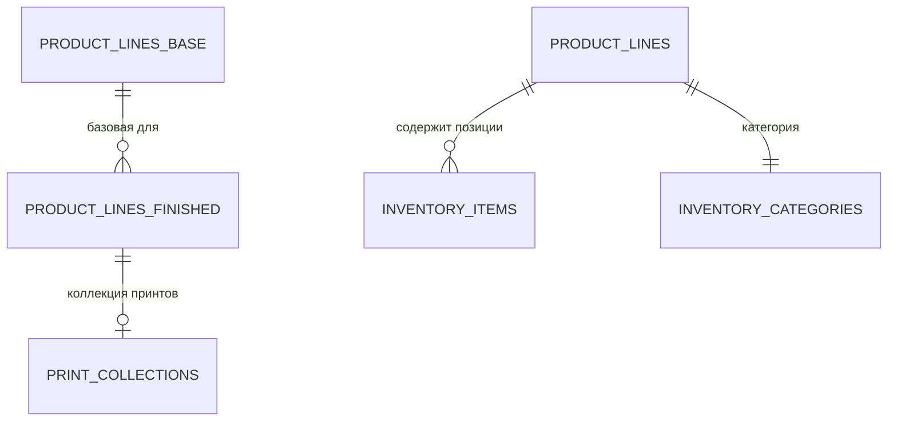

---

## 8b. Админ-панель

Страница `/admin-panel`. Доступ: **только Руководство**.

### Подразделы

- **Обзор** (`admin-overview-client.tsx`): Общая статистика системы, виджеты.
- **Пользователи** (`/admin-panel/users`): CRUD-управление сотрудниками — создание, редактирование, назначение ролей и отделов, активация/деактивация.
- **Роли** (`/admin-panel/roles`): Управление ролями, редактирование JSON-объекта `permissions`.
- **Отделы** (`/admin-panel/departments`): Создание и редактирование бизнес-единиц (цвета, активность).
- **Брендинг** (`/admin-panel/branding`): Загрузка логотипов, настройка цветов, символа валюты.
- **Мониторинг** (`/admin-panel/monitoring`): Системный мониторинг — журнал ошибок, события безопасности.
- **Уведомления** (`/admin-panel/notifications`): Управление системными уведомлениями.
- **Хранилище** (`/admin-panel/storage`): Управление файловым хранилищем, загруженными файлами. Серверные действия: `storage-actions.ts`.

### Глобальный поиск (`admin-search.tsx`)

Поисковая строка с быстрой навигацией по разделам админ-панели.

---

## 8c. Глобальный поиск и Механизм отмены действий

### Глобальный поиск (`globalSearch()`)

Единый поиск по **10 типам сущностей** с учётом прав доступа по отделам.

| Тип | Доступ по отделам | Описание |
|---|---|---|
| `order` | Руководство, Продажи, Производство | Поиск по номеру заказа (`ORD-YY-NNNN`). |
| `client` | Руководство, Продажи | Поиск по ФИО, компании, телефону, email. |
| `item` | Руководство, Продажи, Производство, Дизайн | Поиск по названию товара и SKU. |
| `user` | Только Руководство | Поиск по имени и email. |
| `task` | Все | Поиск по названию и описанию задачи. |
| `promocode` | Руководство, Продажи | Поиск по коду промокода. |
| `wiki` | Все | Поиск по заголовку и содержимому статей. |
| `location` | Руководство, Продажи, Производство, Дизайн | Поиск по названию и адресу склада. |
| `expense` | Только Руководство | Поиск по описанию расхода. |
| `category` | Руководство, Продажи, Производство, Дизайн | Поиск по названию категории склада. |

Дополнительно поиск индексирует **13 страниц навигации** (Заказы, Клиенты, Склад, Финансы, Админ-панель и т.д.) для быстрого перехода по разделам. Каждая страница имеет набор русских ключевых слов.

### Механизм отмены действий (`undoLastAction()`)

Система позволяет отменить **последнее действие** текущего пользователя. Работает через аудит-лог:

1. Находит последнюю запись в `audit_logs` для текущего `userId`.
2. Проверяет наличие `previousState` в поле `details`.
3. Если `previousState` есть — откатывает изменения в транзакции:
   - Для `client` — восстанавливает предыдущие поля клиента.
   - Для `inventory_item` — восстанавливает поля товара.
   - Для `order` — восстанавливает статус и cancelReason.
4. Создаёт запись `Отмена: ...` в аудит-логе со ссылкой на отменённый лог.

---

## 8d. Профиль пользователя

Страница `/dashboard/profile`. Доступна каждому авторизованному сотруднику.

### Вкладки профиля

- **Обзор** (`OverviewTab.tsx`): Общая информация о сотруднике, роль, отдел, дата создания.
- **Настройки** (`SettingsTab.tsx`): Редактирование личных данных.
- **Уведомления** (`NotificationsTab.tsx`): Настройки получения уведомлений.
- **Форма профиля** (`profile-form.tsx`): Редактирование ФИО, контактов, аватара.
- **Смена пароля** (`password-form.tsx`): Изменение пароля с валидацией.
- **2FA** (`2fa-setup.tsx`): Настройка двухфакторной аутентификации (TOTP).
- **Сессии** (`sessions.tsx`): Просмотр активных сессий (IP, User-Agent, дата), возможность завершить чужие сессии.
- **Расписание** (`schedule-view.tsx`): Просмотр рабочего расписания.
- **Статистика** (`statistics-view.tsx`): Персональная статистика работы.

---

## 8e. Референсы (Витрина UI-компонентов)

Страница `/dashboard/references`. Доступ: **только Руководство**.

Коллекция из **26 UI-шоукейсов** — визуальных примеров компонентов интерфейса. Используется как внутренний дизайн-каталог и витрина возможностей UI-системы. Примеры: аналитические дашборды, карточки, файловый менеджер, виджеты, боковые панели, навигации, тултипы, шаги и меню.

---

## 8f. Инфраструктура, интеграции и утилиты

В системе реализован ряд системных утилит и фоновых процессов для обеспечения бесперебойной работы.

### S3-хранилище (`lib/s3.ts`)

Централизованное хранение всех медиафайлов, генерируемых пользователями (макеты, вложения к заказам, превью принтов).
- Интеграция через `@aws-sdk/client-s3`.
- Поддержка пресайнд-ссылок (`getPresignedUrl`) для временного доступа.
- При загрузке изображений применяется 자동-оптимизация через `sharp`: ресайз до 2560px и конвертация в WebP.

### Локальное хранилище (`lib/local-storage.ts`, `lib/avatar-storage.ts`)

Используется для файлов, критичных к скорости доступа или не требующих облачного хранения (логотипы брендинга, аватары пользователей).
- Аватары сохраняются локально (`/api/storage/avatars/`). Загрузчик очищает старый аватар при загрузке нового во избежание засорения ФС.

### Обработка изображений (`lib/image-processing.ts`)

Клиентская утилита для сжатия фото перед загрузкой.
- Поддержка форматов: JPEG, PNG, WebP.
- Поддержка декодирования HEIC (через библиотеку `heic-decode` и Canvas) для приема фото с iPhone напрямую.

### Email-уведомления (`lib/email.ts`)

Транзакционные письма (подтверждение почты, сброс пароля) отправляются через провайдера **Resend**.

### Резервное копирование (`lib/backup.ts`)

Система автоматического снятия потоковых JSON-дампов таблиц (`users`, `clients`, `orders`, `inventoryItems` и др.).
- Триггеры: ручной запуск из Админ-панели (`/admin-panel/monitoring`) или по расписанию через Cron API (`/api/cron/backup`).
- Результаты сохраняются в `/public/uploads/backups`.

### Автоматизации (`lib/automations.ts`)

Триггерные механики. Например, функция `autoGenerateTasks()` вызывается при смене статуса заказа.
- Если статус `design` → автоматически ставится задача на Отдел Дизайна.
- Если статус `production` → задача на Производство с указанием дедлайна.

### Системные скрипты (`scripts/`)
Набор сервисных Node.js скриптов для обслуживания базы данных:
- `seed.ts`, `seed-*.ts` — Сидирование базы данных фейковыми или начальными данными (категории, юзеры, товары, заказы).
- `security-audit.ts` — Скрипт проверки безопасности, прав доступа по ролям и конфигурации rate-limit.
- `cleanup_naming.ts`, `check-db.ts` — Утилиты для валидации целостности схемы и данных (отсутствие "битых" связей).
- `setup-e2e.ts` — Настройка тестового окружения для E2E-тестов.

---

## 9. Справочник статусов, бейджей и цветовой индикации

### 9.1 Статусы заказов

| Статус | Код | Цвет | Описание |
|---|---|---|---|
| Новый | `new` | ⚪️ Серый/Нейтральный | Заказ только создан. |
| Дизайн | `design` | 🟡 Жёлтый/Оранжевый | Макет на подготовке/согласовании. |
| Производство | `production` | 🔵 Синий | В производственном цехе. |
| Готов | `done` | 🟢 Зелёный | Готов к выдаче/отгрузке. |
| Доставка | `shipped` | 🟣 Фиолетовый | Отправлен клиенту. |
| Отменён | `cancelled` | 🔴 Красный | Заказ отменён. |

### 9.2 Статусы оплаты

| Статус | Код | Описание |
|---|---|---|
| Не оплачен | `unpaid` | Оплата не поступала. |
| Частично | `partial` | Внесена предоплата, но не полная сумма. |
| Оплачен | `paid` | Полная оплата получена. |
| Возврат | `refunded` | Средства возвращены клиенту. |

### 9.3 Статусы доставки

| Статус | Код | Описание |
|---|---|---|
| Не начата | `not_started` | Доставка ещё не оформлена. |
| Отправлено | `shipped` | Товар в пути. |
| Доставлено | `delivered` | Товар получен клиентом. |
| Отменена | `cancelled` | Доставка отменена. |

### 9.4 Производственные стадии

| Статус | Код | Описание |
|---|---|---|
| Ожидание | `pending` | Стадия ещё не начата. |
| В работе | `in_progress` | Стадия выполняется. |
| Завершена | `done` | Стадия пройдена успешно. |
| Брак | `failed` | Обнаружен дефект. |

### 9.5 Причины брака (`defect_reason`)

`equipment_failure` (поломка оборудования), `human_error` (ошибка оператора), `material_defect` (дефект материала), `other`.

### 9.6 Типы уведомлений

| Тип | Код | Описание |
|---|---|---|
| Информация | `info` | Общее информационное сообщение. |
| Предупреждение | `warning` | Требует внимания. |
| Успех | `success` | Операция завершена успешно. |
| Ошибка | `error` | Критическая ошибка. |
| Перемещение | `transfer` | Складское перемещение. |

### 9.7 Типы товаров на складе

| Тип | Код | Описание |
|---|---|---|
| Одежда | `clothing` | Футболки, худи, поло и т.д. |
| Упаковка | `packaging` | Коробки, пакеты, бирки. |
| Расходники | `consumables` | Краска, плёнка, нитки. |

### 9.8 Единицы измерения

`шт.`, `см`, `м`, `гр`, `кг`, `мл`, `л`.

---

## 10. Архитектура Базы Данных (Drizzle ORM)

База данных построена на **PostgreSQL** с использованием **Drizzle ORM** для типизации запросов и управления миграциями. Все схемы находятся в директории `lib/schema/`.

### 10.1 Глобальная ER-диаграмма основных сущностей

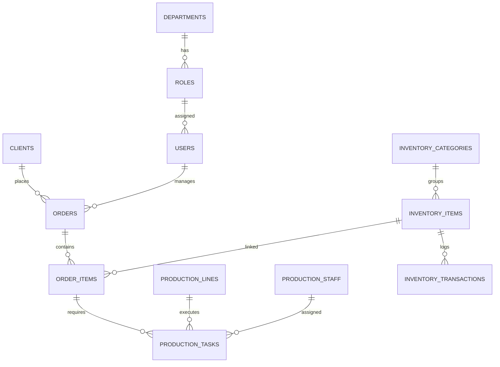

### 10.2 Описание ключевых доменов данных

1.  **Core (Пользователи и Права)**: 
    - `departments`: Структурные подразделения.
    - `roles`: Роли с JSON-объектом `permissions` (права доступа).
    - `users`: Основная сущность сотрудника со статистикой активности.
    - `sessions`, `accounts`: Системные таблицы Better Auth.

2.  **Sales (Продажи)**:
    - `clients`: Профили клиентов с денормализованным LTV и RFM-статусами.
    - `orders`: Заказы с привязкой к менеджеру, клиенту и промокоду.
    - `order_items`: Каждая позиция заказа с трекингом стадий (подготовка, печать).

3.  **Production (Цех)**:
    - `production_lines`: Производственные мощности (Шелкография, Вышивка и т.д.).
    - `production_tasks`: Конкретные операции на линиях с трекингом `actualTime`.
    - `production_staff`: Мастера-исполнители.

4.  **Warehouse (WMS)**:
    - `inventory_items`: Товары и расходники с полями `quantity` и `reservedQuantity`.
    - `inventory_transactions`: Журнал любых движений ТМЦ (приход, списание, перемещение).

5.  **Audit & System**:
    - `audit_logs`: История всех изменений (кто, когда, что изменил в JSON).
    - `tasks`: Внутренние поручения с чек-листами и историей.
    - `notifications`: Очередь системных уведомлений.

---

## 11. Каталог сервисных скриптов

Директория `scripts/` содержит служебные утилиты для обслуживания базы данных, тестирования и миграций. Запуск производится через `npx tsx scripts/<filename>.ts`.

### 11.1 Группы скриптов

#### 🟢 Сидирование и Тестовые данные
- `seed.ts`: Полная инициализация БД (отделы, роли, админ-пользователь).
- `seed-categories.ts`: Загрузка иерархии категорий склада.
- `seed-test-order.ts`: Создание демо-заказа с товарами и дизайном для отладки.
- `seed-presence.ts`: Генерация тестовых данных о присутствии сотрудников.

#### 🟡 Валидация и Проверка
- `check-db.ts`: Экспресс-проверка соединения и вывод последних записей в ключевых таблицах.
- `check-categories.ts`: Поиск ошибок в иерархии категорий (циклы, битые ссылки).
- `check-attributes.ts`: Проверка корректности JSON-метаданных у складских позиций.
- `check-connection.js`: Базовая проверка доступности DB (используется при запуске dev-сервера).

#### 🔴 Обслуживание и Очистка (Cleanup)
- `cleanup_naming.ts`: Приведение названий единиц измерения к единому стандарту (шт -> штука, см -> сантиметры).
- `cleanup-avatars.ts`: Удаление неиспользуемых файлов аватаров из S3/хранилища.
- `fix-text-name.ts`: Исправление форматирования имен пользователей и клиентов.
- `clear-db.ts`: **ОПАСНО.** Полная очистка всех таблиц БД.

#### 🛡️ Безопасность и Инфраструктура
- `security-audit.ts`: Скрипт полного статического анализа кода. Проверяет наличие `getSession()` в Server Actions, SQL-инъекции, XSS и IDOR риски.
- `setup-e2e.ts`: Подготовка окружения для сквозного тестирования (Playwright/Cypress).

### 11.2 Ключевые автоматизации
Многие скрипты интегрированы в `package.json` и выполняются автоматически при CI/CD или деплое. Например, `security-audit.ts` рекомендуется запускать перед каждым крупным релизом для верификации защиты данных.
---

## 12. Схемы взаимодействия (Cross-Module Workflows)

В данном разделе описаны процессы, затрагивающие несколько модулей системы одновременно.

### 12.1 Сквозной процесс: От Клиента до Отгрузки

Эта схема показывает, как данные проходят через всю CRM.

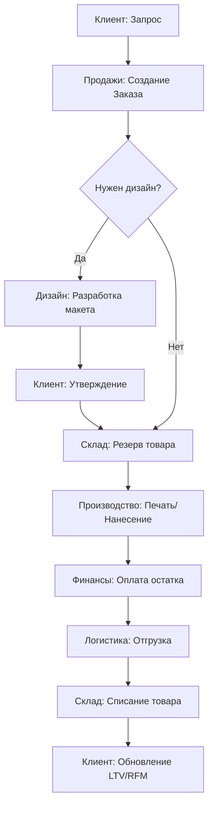

### 12.2 Взаимодействие: Заказ -> Склад -> Финансы

Детальная схема триггеров и автоматических действий.

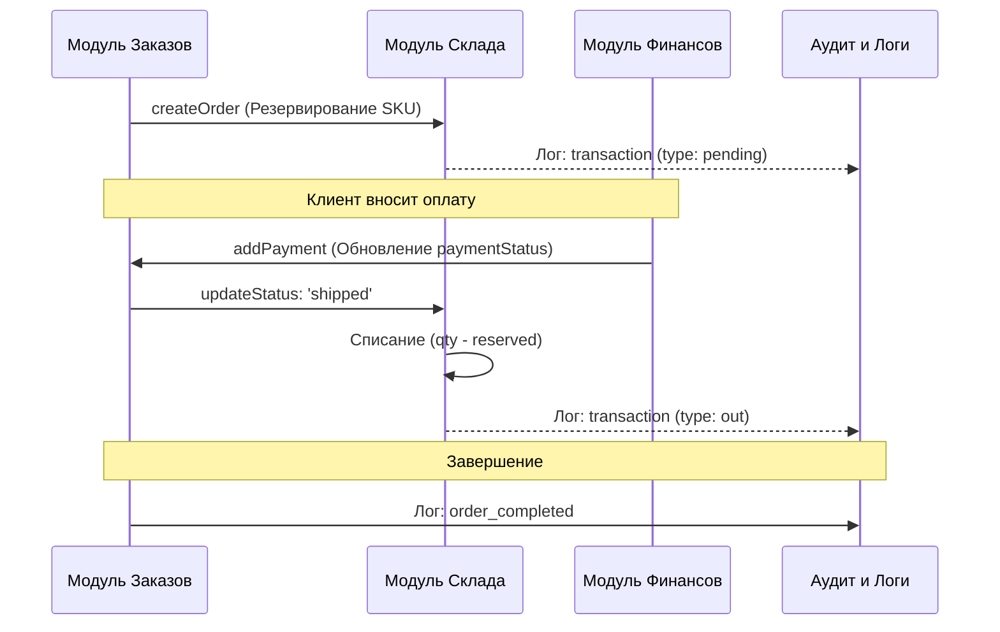

### 12.3 Интеграция: Дизайн -> Производство -> Склад

Схема подготовки производственных задач.

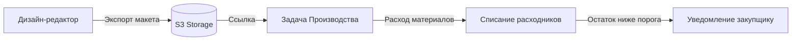

### 12.4 Система Присутствия и Рабочий процесс

Схема связи физического присутствия с задачами.

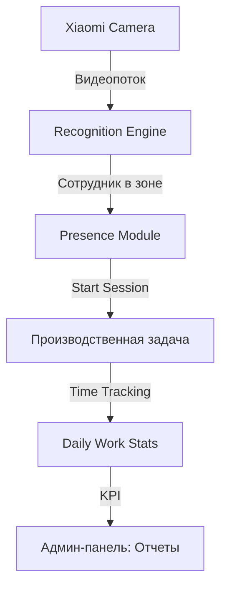
### 12.5 Архитектура Инфраструктуры (System Overview)

Схема связей серверной части с внешними сервисами и базой данных.

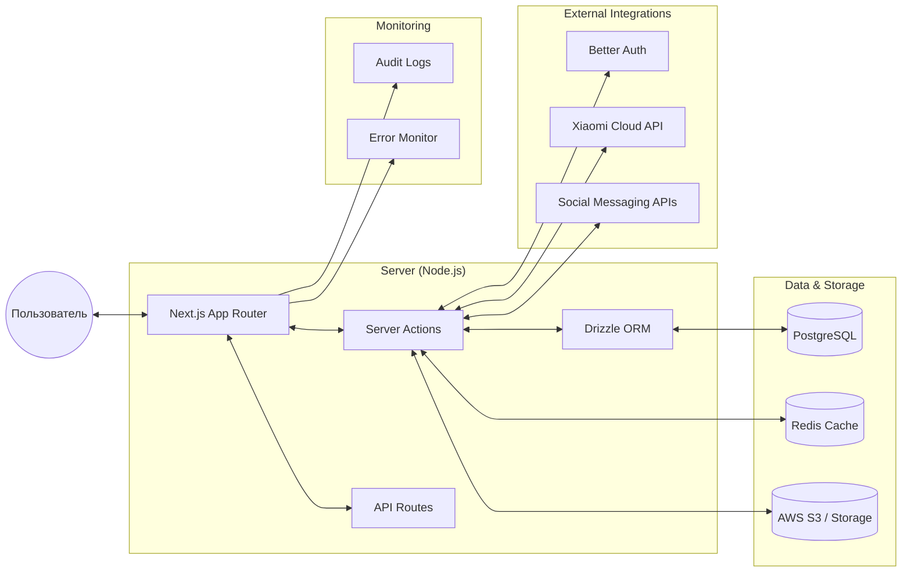

### 12.6 Логика Server Action (Middleware Pattern)

Типовой процесс обработки запроса в системе для обеспечения безопасности и целостности.

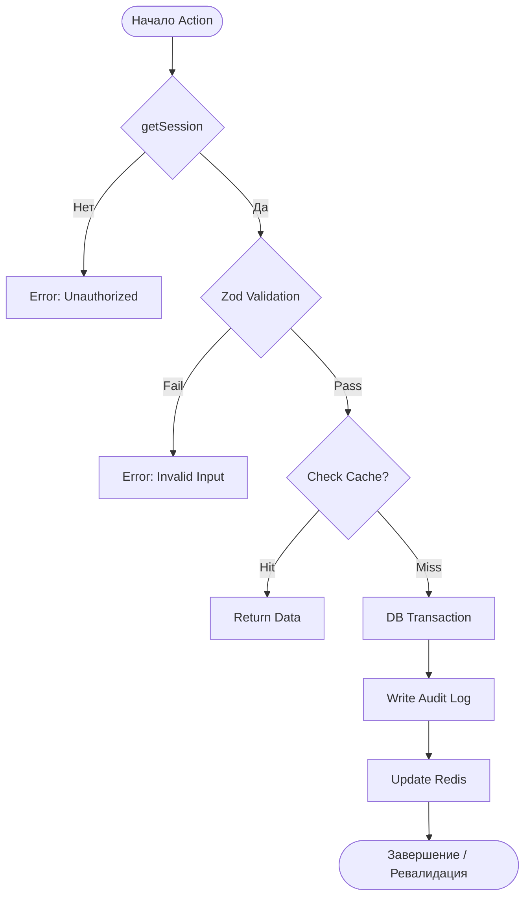

### 12.7 Жизненный цикл ТМЦ (Склад)

Схема движения товаров от прихода до списания.

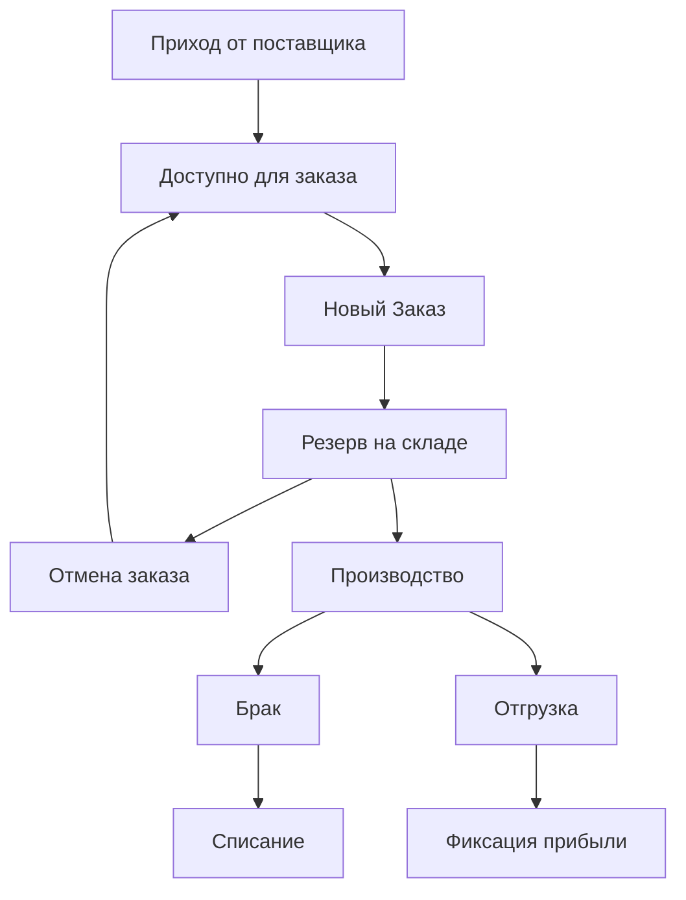
