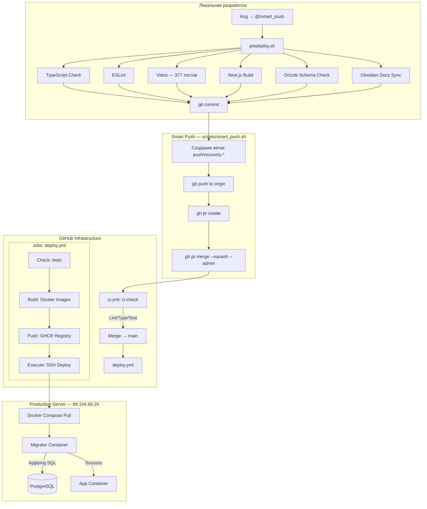

# 🚀 Инфраструктура CI/CD

Система автоматизации MerchCRM построена на базе GitHub Actions и Docker, обеспечивая безопасное внесение изменений и детерминированное развертывание.

## 1. Схема Пайплайна



## 2. Workflows

### CI Checks (`ci.yml`)
Запускается при каждом Pull Request в ветку `main`.
- **Задачи**: `lint`, `type-check`, `vitest`.
- **База**: Поднимает временные PostgreSQL и Redis в Docker для тестов.
- **Блокировка**: Настроена Branch Protection — мердж невозможен без прохождения всех статус-чеков.

### Deploy (`deploy.yml`)
Запускается при пуше в `main`.
- **Этапы**:
  1. **Check**: Финальный прогон тестов.
  2. **Build-and-push**: Сборка двух образов (`merch-crm` и `merch-crm-migrator`).
  3. **Deploy**: Вызов SSH-команд на сервере для обновления контейнеров.

### Smart Push (`scripts/smart_push.sh`)
Автоматизация полного цикла: проверка → коммит → PR → merge.
- **Predeploy**: 6 шагов проверки (TypeScript, ESLint, Vitest, Build, Drizzle, Obsidian sync).
- **PR Strategy**: Создание временной ветки `push/recovery-*`, squash merge через `gh pr merge --admin`.
- **Post-merge**: Локальная ветка `main` синхронизируется с `origin/main` через `git reset --hard`.

## 3. Механизм Миграций

Вместо опасного `drizzle-kit push` используется двухэтапный процесс:

### Этап 1: Генерация (Local)
Разработчик создает SQL-файл миграции локально:
```bash
npm run db:generate
```

### Этап 2: Применение (Docker)
На сервере запускается микро-сервис `migrator`:
- **Образ**: `ghcr.io/merch-crm/merch-crm-migrator`.
- **Скрипт**: `scripts/db-migrate.ts`.
- **Особенности**:
  - Использует `tsx` для выполнения TypeScript.
  - Ждет готовности БД.
  - Прогоняет все новые файлы из `/drizzle`.

## 4. Тестирование в CI

| Метрика | Значение |
| :--- | :--- |
| **Файлов тестов** | 75 |
| **Всего тестов** | 377 |
| **Среднее время** | ~17 секунд |
| **Framework** | Vitest 2.1.9 |
| **Покрытие** | Unit + Integration (mock DB) |

### Особенности тестовой инфраструктуры
- **Redis**: В тестах используется `RedisMock` (in-memory Map) — не требует реального Redis.
- **DB Cleanup**: Единый `TRUNCATE ... CASCADE` для минимизации сетевых round-trip.
- **Background tasks**: Мокаются через `vi.mock()` в `tests/setup.ts` для предотвращения connection pool exhaustion.

## 5. Полезные команды

- **Просмотр логов деплоя**: Вкладка "Actions" на GitHub.
- **Проверка статуса миграций на сервере**:
  ```bash
  docker logs merch-crm-migrate
  ```
- **Проверка контейнеров**:
  ```bash
  ssh -i ~/.ssh/antigravity_key root@89.104.69.25 "docker ps"
  ```

---
[[020-Архитектура/Deploy|К руководству по развертыванию]] | [[Merch-CRM|В начало]]
