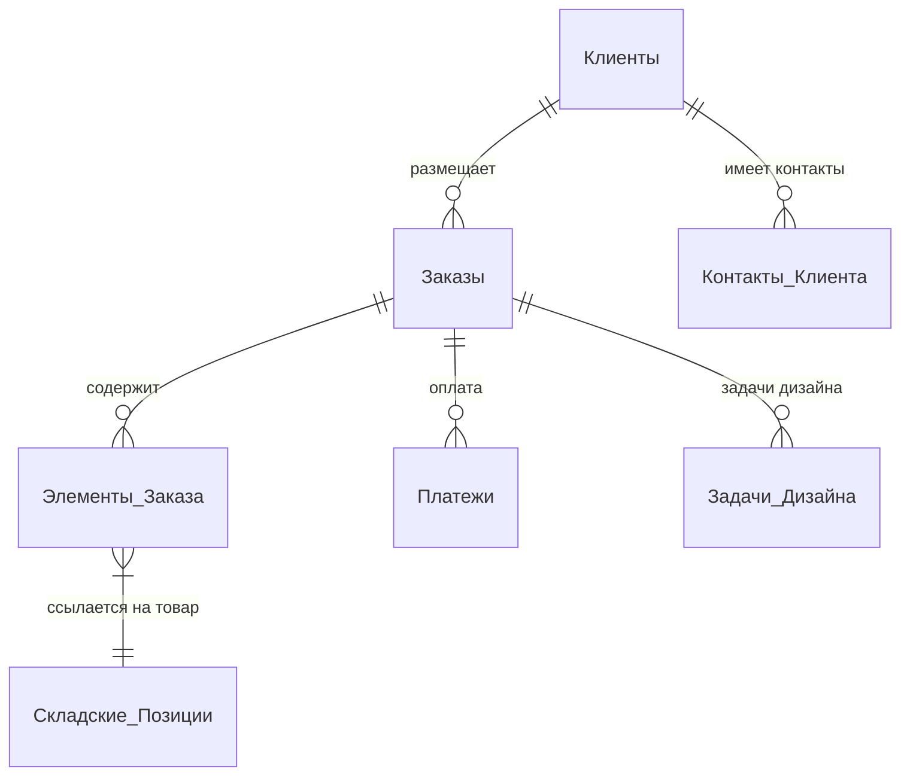
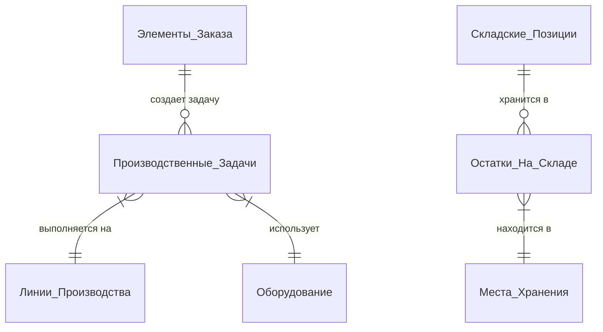
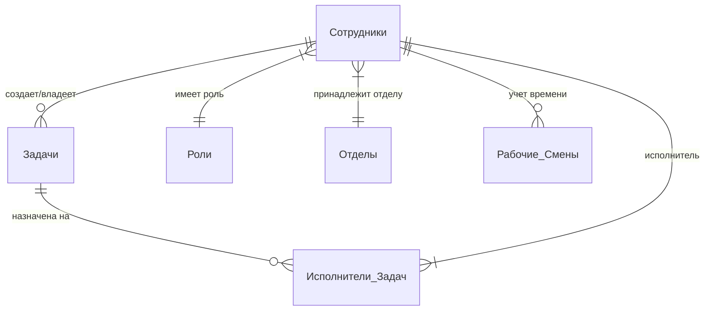

# 🗄️ Схема Связей БД (ERD)

Ниже представлена высокоуровневая схема связей между основными модулями MerchCRM Unified v3.0.

## 1. Ядро: Заказы и Клиенты

## 2. Производство и Склад

## 3. Персонал и Задачи

## Как читать схему
- `||--o{`: Один ко многим (обязательно один к нулю или многим).
- `}|--||`: Многие к одному (или обязательно один).
- Каждая стрелка отражает связь по внешнему ключу (`Foreign Key`) в схеме Drizzle ORM.

---
[[MERCH CRM|🔙 Назад к оглавлению]]
