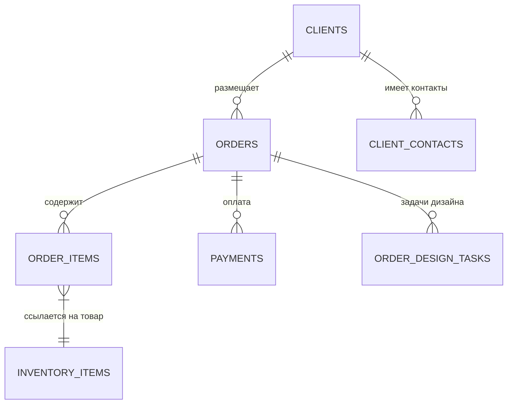
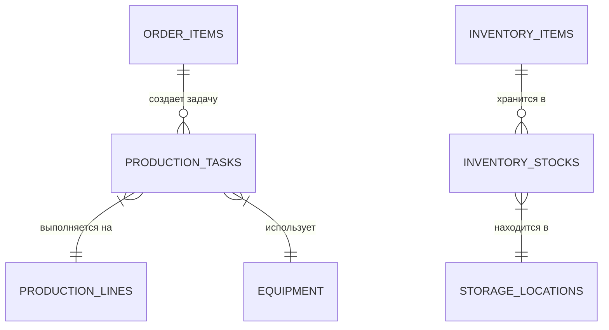
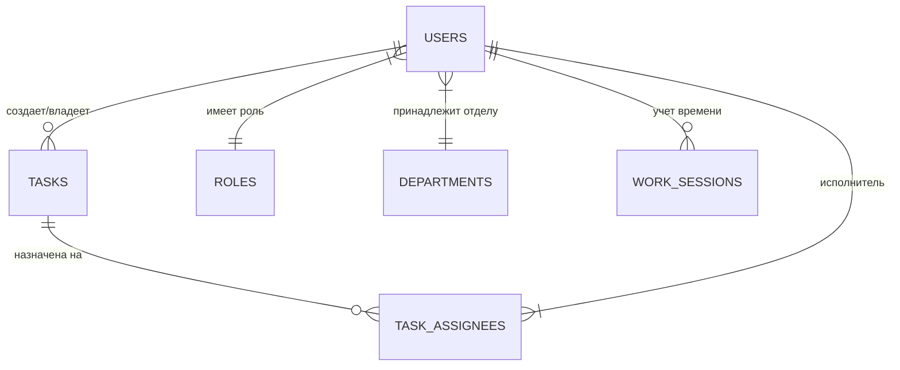

# Схема связей (Database ERD)

Ниже представлена высокоуровневая схема связей между основными модулями MerchCRM Unified v3.0.

## 1. Ядро: Заказы и Клиенты

## 2. Производство и Склад

## 3. Персонал и Задачи

## Как читать схему
- `||--o{`: Один к многим (обязательно один к нулю или многим).
- `}|--||`: Многие к одному.
- Каждая стрелка отражает связь по `Foreign Key` в схеме Drizzle.

---
[[000-Навигация/ОГЛАВЛЕНИЕ|Назад к оглавлению]]
