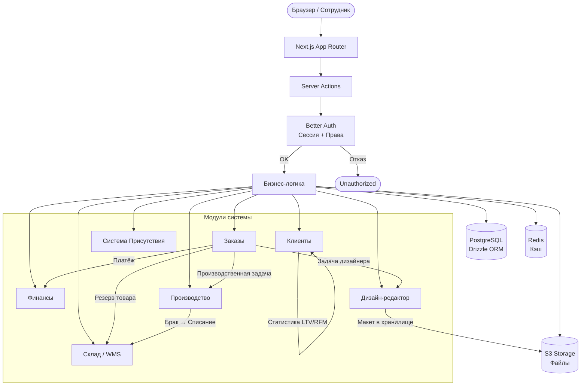
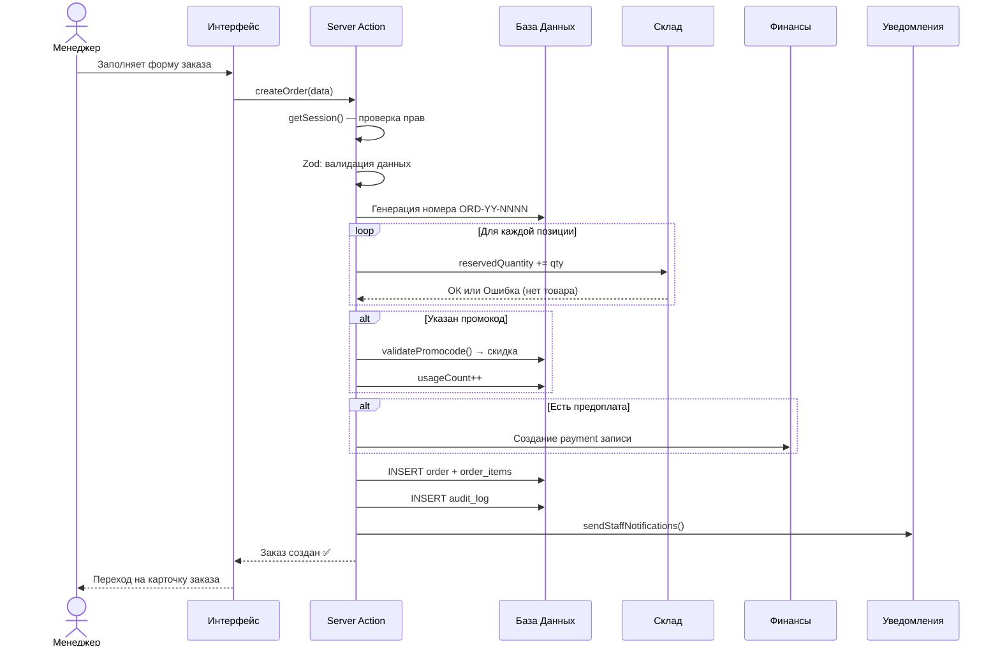
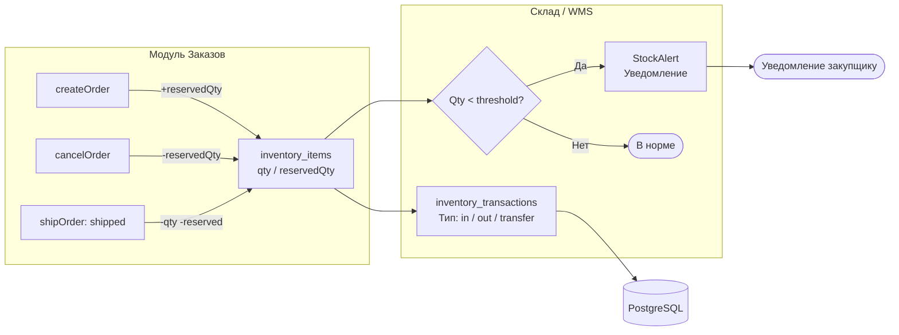
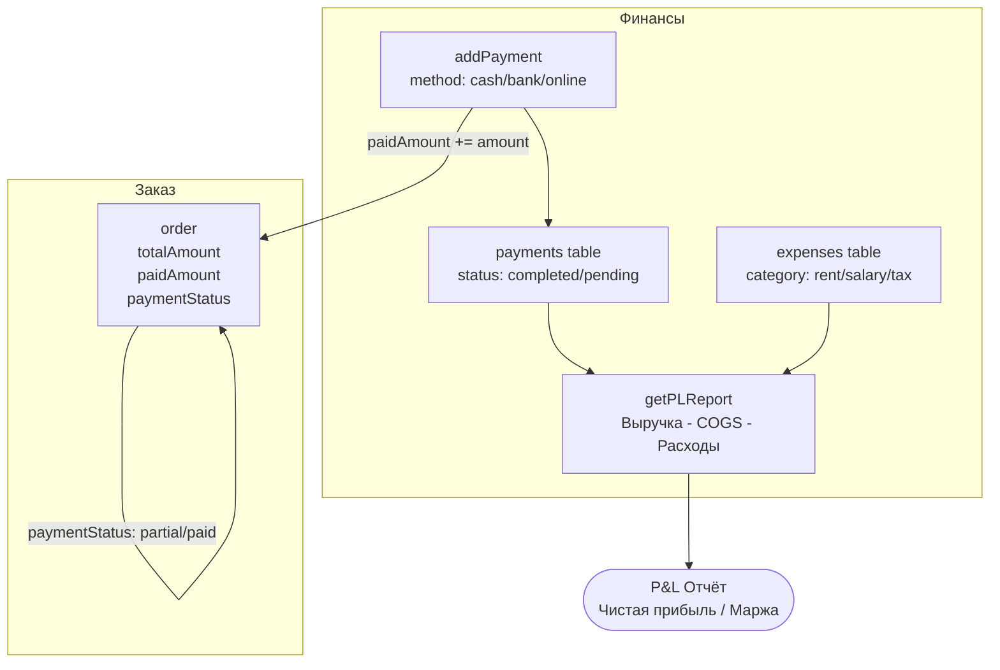
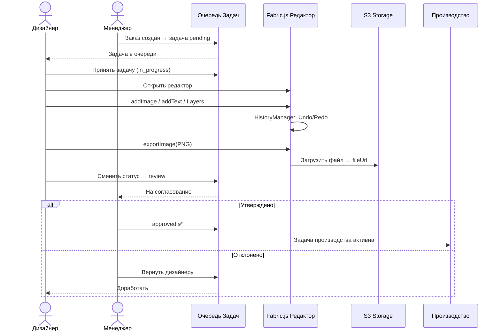
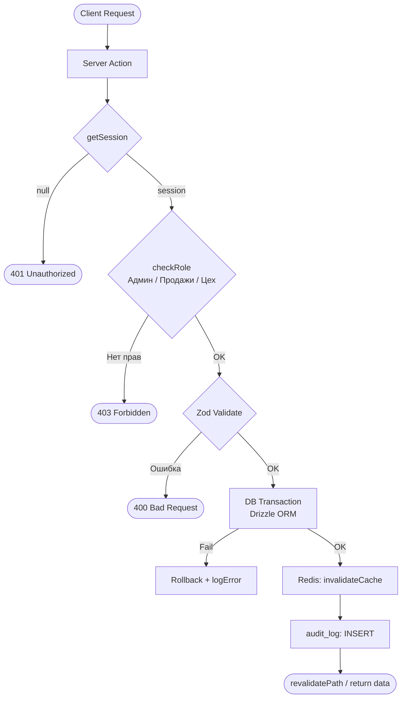
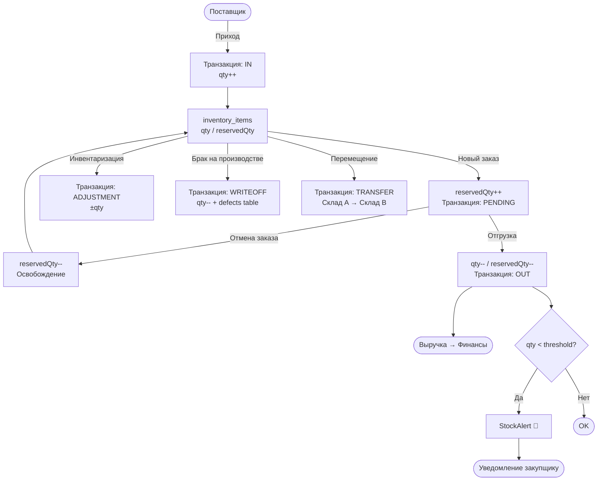

---
tags:
  - архитектура
  - mermaid
  - схемы
created: 2026-04-01
источник: docs/CRM_Architecture.md
---

# 🗺️ Схемы Взаимодействия Модулей MerchCRM

> [!INFO] Источник
> Перенесено из `docs/CRM_Architecture.md`. Актуально на 01.04.2026.

---

## 1. Глобальная Архитектура



---

## 2. Создание Заказа



---

## 3. Смена Статуса Заказа

```mermaid
flowchart TD
    Start([Запрос: сменить статус]) --> Check{Права доступа?}
    Check -->|Нет| Forbidden([Ошибка: нет доступа])
    Check -->|Да| Allowed{Переход разрешён?}

    Allowed -->|Нет| BadTransition([Ошибка: недопустимый переход])
    Allowed -->|Да| Transition[Обновить status в таблице orders]

    Transition --> Case{Новый статус?}

    Case -->|shipped / done| WriteOff[Склад: qty -= reserved\nСоздать транзакцию OUT]
    Case -->|cancelled| Release[Склад: reservedQty -= qty\nОсвободить резерв]
    Case -->|Другой| Skip[Без изменений склада]

    WriteOff --> AuditLog[Запись в audit_log\nfrom → to]
    Release --> AuditLog
    Skip --> AuditLog

    AuditLog --> Tasks[autoGenerateTasks()\nЗадачи для отделов]
    Tasks --> Done([Завершено ✅])
```

---

## 4. Склад ↔ Заказы



---

## 5. Финансы ↔ Заказы



---

## 6. Дизайн → Производство



---

## 7. Server Action: Middleware Pipeline



---

## 8. Полный Жизненный Цикл Товара (Склад)



---

**← К архитектуре**: [[030-Модули/10-Система/База-Знаний|База знаний системы]]
