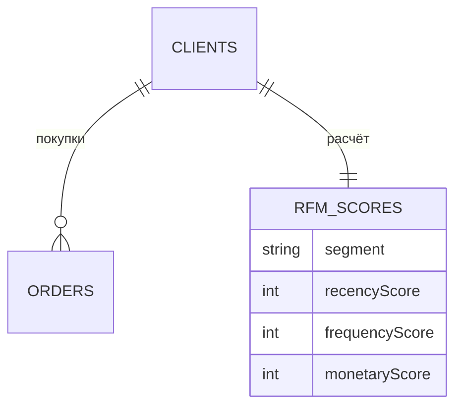

# RFM-Анализ

## 1. Описание (Goal)
Сегментация клиентской базы по трём метрикам: **Recency** (давность последней покупки), **Frequency** (частота покупок), **Monetary** (общая сумма). Позволяет выделить «чемпионов», «лояльных», «спящих» и «потерянных» клиентов для таргетированного маркетинга.

## 2. Связи БД (Relations)

## 3. Функциональность
- [x] Расчёт RFM-скоров для всех клиентов (`calculateAllClientsRFM`)
- [x] Таблица сегментов с количеством клиентов, средним чеком и LTV
- [x] Визуальные бейджи сегментов (`RFMSegmentBadge`)
- [x] Информационная панель «Что такое RFM?»
- [x] Кнопка запуска пересчёта с серверной валидацией

## 4. Техническая реализация (Implementation)
> Стандарт: [[010-Стандарты/Actions|Server Actions v3.0]]

**Файлы:**
- `app/(main)/dashboard/analytics/rfm/page.tsx` — серверная страница
- `app/(main)/dashboard/clients/actions/rfm.actions.ts` — серверные действия
- `app/(main)/dashboard/analytics/rfm/rfm-analysis-trigger.tsx` — клиентский триггер

---
[[MERCH CRM|Назад к оглавлению]]
