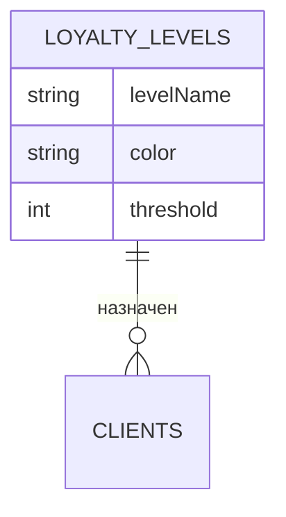

# Лояльность

## 1. Описание (Goal)
Система уровней лояльности клиентов. Настройка порогов перехода между уровнями, привилегий и визуализация распределения клиентов по сегментам. Позволяет руководству видеть, какие клиенты приносят наибольшую выручку и как их удерживать.

## 2. Связи БД (Relations)

## 3. Функциональность
- [x] CRUD уровней лояльности (`getLoyaltyLevels`)
- [x] Распределение клиентов по уровням (`getLoyaltyDistribution`)
- [x] Настройка порогов и привилегий через UI (`LoyaltySettingsClient`)
- [x] Визуализация статистики: клиентов на уровне, общая выручка

## 4. Техническая реализация (Implementation)
> Стандарт: [[010-Стандарты/Actions|Server Actions v3.0]]

**Файлы:**
- `app/(main)/dashboard/analytics/loyalty/page.tsx` — серверная страница
- `app/(main)/dashboard/analytics/loyalty/loyalty-settings-client.tsx` — клиент настроек
- `app/(main)/dashboard/clients/actions/loyalty.actions.ts` — серверные действия
- `app/(main)/dashboard/clients/actions/analytics.actions.ts` — аналитика

---
[[MERCH CRM|Назад к оглавлению]]
