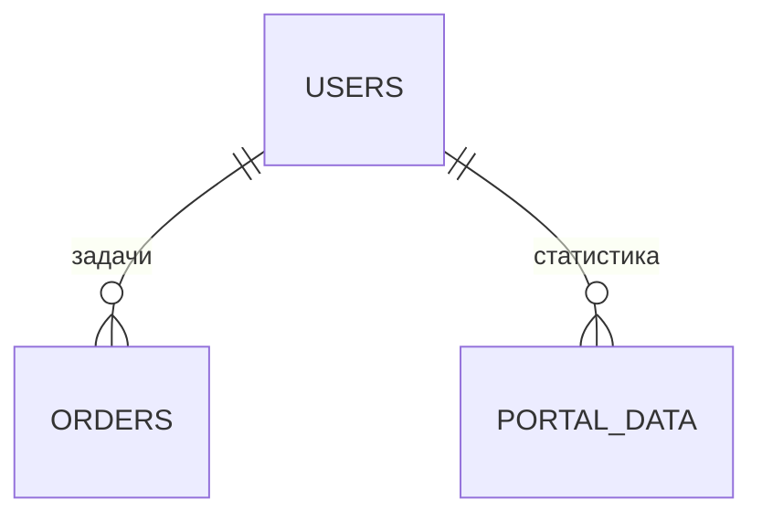

# Портал

## 1. Описание (Goal)
Личный кабинет сотрудника производства. Предоставляет каждому работнику персональный интерфейс для просмотра своих задач, статистики, текущих заказов и доступных операций. Доступ ограничен ролями.

## 2. Связи БД (Relations)

## 3. Функциональность
- [x] Загрузка персональных данных сотрудника (`getPortalData`)
- [x] Права доступа — проверка роли пользователя
- [x] Клиентский интерфейс портала (23KB — полноценный дашборд)
- [x] Обработка ошибок доступа с UI-фидбеком

## 4. Техническая реализация (Implementation)
> Стандарт: [[010-Стандарты/Actions|Server Actions v3.0]]

**Файлы:**
- `app/(main)/dashboard/portal/page.tsx` — серверная страница
- `app/(main)/dashboard/portal/portal-client.tsx` — клиентский интерфейс
- `app/(main)/dashboard/portal/actions.ts` — серверные действия
- `app/(main)/dashboard/portal/types.ts` — типы

---
[[MERCH CRM|Назад к оглавлению]]
