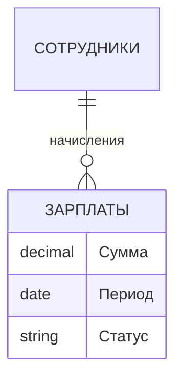

# Зарплаты

## 1. Описание (Goal)
Расчёт и начисление зарплат сотрудникам. Доступ ограничен администраторами и руководством. Поддерживает фильтрацию по периодам (сегодня, 7 дней, 30 дней, год) и кастомные диапазоны.

## 2. Связи БД (Relations)

## 3. Функциональность
- [x] Общий бюджет зарплат (`totalBudget`)
- [x] Детализация по сотрудникам (`employeePayments`)
- [x] Фильтр по периодам: сегодня / 7д / 30д / 365д / кастомный
- [x] Проверка прав: только «Администратор» или отдел «Руководство»
- [x] Клиентский интерфейс (`salary-client.tsx`, 12KB)

## 4. Техническая реализация (Implementation)
> Стандарт: [[010-Стандарты/Actions|Server Actions v3.0]]

**Файлы:**
- `app/(main)/dashboard/finance/salary/page.tsx` — серверная страница
- `app/(main)/dashboard/finance/salary-client.tsx` — клиентский интерфейс
- `app/(main)/dashboard/finance/actions.ts` — серверные действия (`getSalaryStats`)

---
[[MERCH CRM|Назад к оглавлению]]
