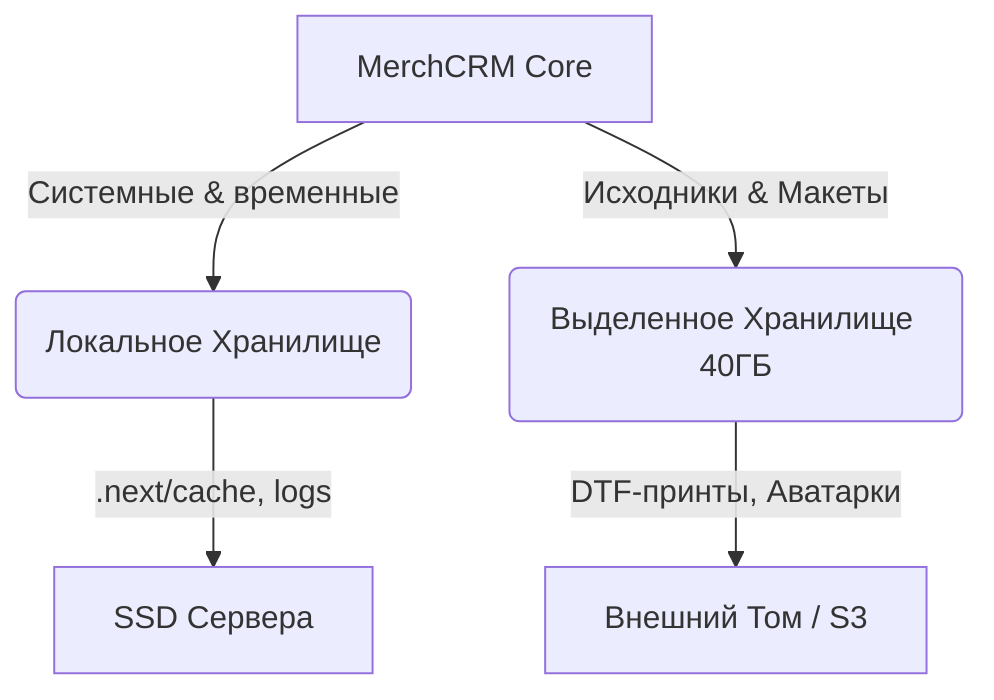

# 🧱 Подраздел: Хранилище

## 🎯 1. Цель (Goal)
Модуль управляет инстансами хранения статических и пользовательских файлов. Хранилище разделено на два изолированных пространства для баланса между производительностью и стоимостью, а также для защиты основного диска приложения от переполнения тяжелыми макетами.

## 📐 2. Архитектура (Architecture)

## 📋 3. Структура Документации
- [[Локальное-Хранилище]] — использование диска на продакшен-сервере.
- [[Выделенное-Хранилище-40ГБ]] — работа с тяжелым хранилищем принтов и макетов.

## 🔗 4. Интеграции
Файловая система глубоко интегрирована со следующими модулями:
- **[[05-Дизайн/Дизайн]]**: Исходники и мокапы.
- **[[04-Производство/Производство]]**: Рулоны и сгенерированные файлы на печать.
- **[[01-Заказы/Заказы]]**: PDF чеков и накладных.
- **[[02-Клиенты/Клиенты]]**: Аватарки пользователей и приложенные к тикетам файлы.

---
[[Админ-Панель|Назад к Админ Панели]] | [[Merch-CRM|На главную]]
