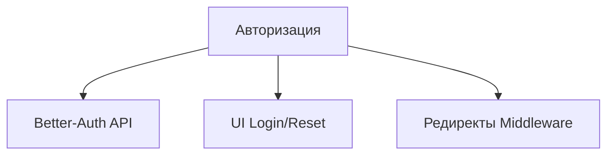

# 🧱 Модуль: Авторизация

## 🎯 1. Цель (Goal)
Обеспечение безопасного входа в систему, регистрации по инвайтам и восстановления паролей. Модуль отвечает за аутентификацию (authentication) и делегирует права доступа (authorization) модулю "Пользователи".

## 📐 2. Архитектура (Architecture)
Модуль изолирован в роут-группе `(auth)`.

### Схема связей

## 📋 3. Требования (Requirements)
- [x] Форма логина
- [x] Валидация сессии
- [x] Ограничение доступа для неавторизованных

## 🛠️ 4. Технический Стек (Tech Stack)
- **Frontend:** Next.js Server Components, Forms
- **Backend:** `better-auth`
- **Validations:** Zod schema

---
[[Merch-CRM|Назад к оглавлению]]
