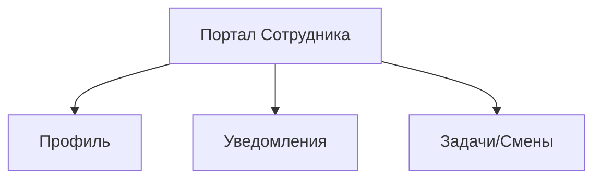

# 🧱 Модуль: Портал Сотрудника

## 🎯 1. Цель (Goal)
Личный кабинет сотрудника для управления своими данными, отслеживания KPI, графиков смен и коммуникации с руководством.

## 📐 2. Архитектура (Architecture)
Модуль изолирован в роут-группе `(staff)`.

### Схема связей

## 📋 3. Требования (Requirements)
- [ ] Отображение профиля
- [ ] Управление 2FA

## 🛠️ 4. Технический Стек (Tech Stack)
- **Frontend:** Next.js
- **Backend:** Prisma ORM, Server Actions

---
[[Merch-CRM|Назад к оглавлению]]
