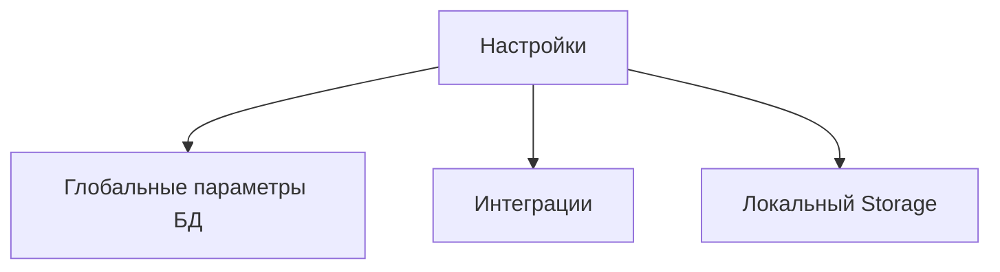

# 🧱 Модуль: Настройки

## 🎯 1. Цель (Goal)
Глобальные и пользовательские настройки системы: локализация, тема, справочники (цвета, размеры, типы), интеграции API.

## 📐 2. Архитектура (Architecture)
Связан с роутом `dashboard/settings/`.

### Схема связей

## 📋 3. Требования (Requirements)
- [ ] Управление справочниками
- [ ] Настройка внешнего вида
- [ ] Настройки безопасности

## 🛠️ 4. Технический Стек (Tech Stack)
- **Frontend:** React Context, LocalStorage
- **Backend:** Server Actions

---
[[Merch-CRM|Назад к оглавлению]]
