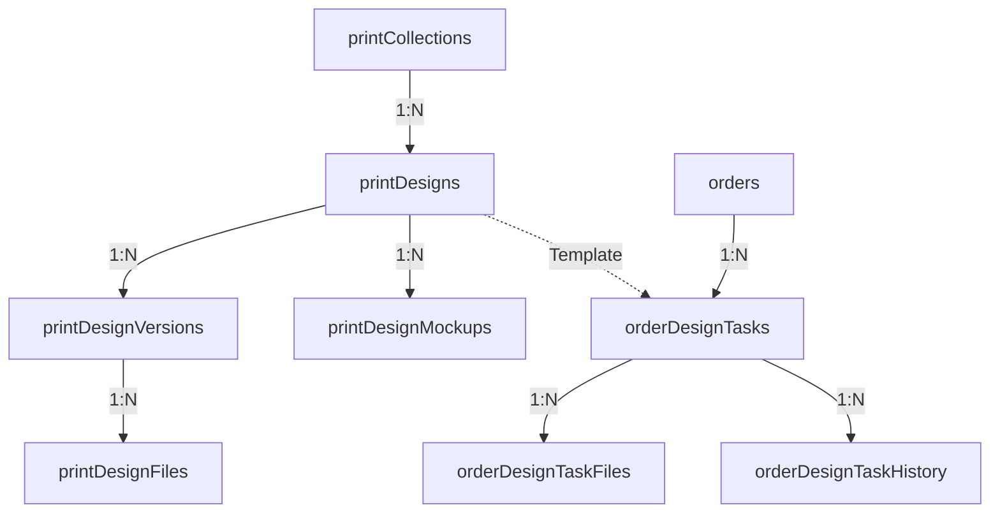

# Дизайн (Design Studio)

Управление каталогом принтов: коллекции → дизайны → версии → файлы → мокапы.

---

## 1. Таблица `print_collections`

> **Файл:** `lib/schema/designs.ts`

| Поле | Тип | Описание |
|---|---|---|
| `id` | `uuid PK` | Идентификатор (НЕ defaultRandom!) |
| `name` | `varchar(255) NOT NULL` | Название коллекции |
| `slug` | `varchar(255) NOT NULL` | URL-slug |
| `description` | `text` | Описание |
| `coverImage` | `varchar(500)` | Обложка |
| `isActive` | `boolean DEFAULT true NOT NULL` | Активна |
| `sortOrder` | `integer DEFAULT 0 NOT NULL` | Порядок |
| `createdBy` | `uuid FK → users NOT NULL` | Автор |
| `createdAt` / `updatedAt` | `timestamp NOT NULL` | Даты |

### Индексы
- `print_collections_active_idx`, `_sort_order_idx`, `_slug_idx`, `_created_by_idx`, `_created_at_idx`

---

## 2. Таблица `print_designs`

| Поле | Тип | Описание |
|---|---|---|
| `id` | `uuid PK` | Идентификатор (НЕ defaultRandom!) |
| `collectionId` | `uuid FK → printCollections (CASCADE) NOT NULL` | Коллекция |
| `name` | `varchar(255) NOT NULL` | Название принта |
| `description` | `text` | Описание |
| `preview` | `varchar(500)` | Путь к превью |
| `printFilePath` | `text` | Путь к файлу печати |
| `applicationTypeId` | `uuid` | Тип нанесения (без FK!) |
| `costPrice` | `integer` | Себестоимость (копейки) |
| `retailPrice` | `integer` | Розничная цена (копейки) |
| `isActive` | `boolean DEFAULT true NOT NULL` | Активен |
| `sortOrder` | `integer DEFAULT 0 NOT NULL` | Порядок |
| `createdAt` / `updatedAt` | `timestamp NOT NULL` | Даты |

> ⚠️ **Нет полей** `status`, `tags`, `isPublic`, `createdById`. Цены в integer (копейки!). `preview` — не `previewUrl`.

---

## 3. Таблица `print_design_versions`

| Поле | Тип | Описание |
|---|---|---|
| `id` | `uuid PK` | Идентификатор |
| `designId` | `uuid FK → printDesigns (CASCADE) NOT NULL` | Дизайн |
| `name` | `varchar(255) NOT NULL` | Название версии |
| `preview` | `varchar(500)` | Путь к превью |
| `sortOrder` | `integer DEFAULT 0 NOT NULL` | Порядок |
| `createdAt` / `updatedAt` | `timestamp NOT NULL` | Даты |

> ⚠️ **Нет полей** `versionNumber`, `imageUrl`, `sourceFileUrl`, `changeDescription`, `isCurrent`, `createdById`. Версия = просто имя + превью.

---

## 4. Таблица `print_design_files`

Файлы, прикреплённые к конкретной версии дизайна.

| Поле | Тип | Описание |
|---|---|---|
| `id` | `uuid PK` | Идентификатор |
| `versionId` | `uuid FK → printDesignVersions (CASCADE) NOT NULL` | Версия |
| `filename` | `varchar(255) NOT NULL` | Имя файла в хранилище |
| `originalName` | `varchar(255) NOT NULL` | Оригинальное имя |
| `format` | `varchar(20) NOT NULL` | Формат (png, svg, ai, pdf) |
| `fileType` | `text NOT NULL` | Тип файла |
| `size` | `integer NOT NULL` | Размер (байт) |
| `width` | `integer` | Ширина (px, для изображений) |
| `height` | `integer` | Высота (px) |
| `path` | `varchar(500) NOT NULL` | Путь к файлу |
| `createdAt` | `timestamp NOT NULL` | Создано |

---

## 5. Таблица `print_design_mockups`

Мокапы дизайна (визуализация на изделии).

| Поле | Тип | Описание |
|---|---|---|
| `id` | `uuid PK` | Идентификатор |
| `designId` | `uuid FK → printDesigns (CASCADE) NOT NULL` | Дизайн |
| `name` | `text NOT NULL` | Название мокапа |
| `description` | `text` | Описание |
| `preview` | `text` | Превью |
| `imagePath` | `text` | Путь к изображению |
| `color` | `varchar(50)` | Цвет изделия |
| `isActive` | `boolean DEFAULT true NOT NULL` | Активен |
| `sortOrder` | `integer DEFAULT 0 NOT NULL` | Порядок |
| `createdAt` / `updatedAt` | `timestamp NOT NULL` | Даты |

---

## 6. Таблица `order_design_tasks`

Задачи по подготовке макетов для конкретных заказов.

> **Файл:** `lib/schema/design-tasks.ts`

| Поле | Тип | Описание |
|---|---|---|
| `id` | `uuid PK` | Идентификатор (defaultRandom) |
| `orderId` | `uuid FK → orders (CASCADE) NOT NULL` | Заказ |
| `orderItemId` | `uuid FK → orderItems (CASCADE)` | Позиция заказа |
| `number` | `varchar(50) NOT NULL` | Номер задачи |
| `title` | `text NOT NULL` | Заголовок |
| `description` | `text` | Описание |
| `status` | `orderItemDesignStatusEnum DEFAULT 'pending' NOT NULL` | Статус (pending, in_progress, review, approved, revision, not_required) |
| `priority` | `integer DEFAULT 0` | Приоритет (0-обычный, 1-высокий, 2-срочный) |
| `assigneeId` | `uuid FK → users` | Исполнитель (дизайнер) |
| `dueDate` | `timestamp` | Дедлайн |
| `sourceDesignId` | `uuid FK → printDesigns` | Шаблон из каталога |
| `clientNotes` | `text` | Примечания клиента |
| `printArea` | `text` | Зона печати |
| `quantity` | `integer` | Тираж |
| `colors` | `integer` | Кол-во цветов |
| `applicationTypeId` | `uuid FK → applicationTypes` | Тип нанесения |
| `completedAt` | `timestamp` | Завершено |
| `createdBy` | `uuid FK → users` | Кто создал |
| `createdAt` / `updatedAt` | `timestamp NOT NULL` | Даты |

### Под-таблицы (Tasks)
- `order_design_task_files`: Файлы задач (preview, source, mockup, client_file).
- `order_design_task_history`: История изменений задачи (status_change, comment, file_upload, assignment).

---

## 7. Иерархия Relations (Catalog)

- `printCollections` → `creator` (one: `users`)
- `printCollections` → `designs` (many)
- `printDesigns` → `collection` (one)
- `printDesigns` → `versions` (many)
- `printDesigns` → `mockups` (many)
- `printDesignVersions` → `design` (one)
- `printDesignVersions` → `files` (many)
- `printDesignFiles` → `version` (one)

## 8. Иерархия Relations (Tasks)

- `orderDesignTasks` → `order` (one → `orders`)
- `orderDesignTasks` → `orderItem` (one → `orderItems`)
- `orderDesignTasks` → `assignee` (one → `users`)
- `orderDesignTasks` → `sourceDesign` (one → `printDesigns`)
- `orderDesignTasks` → `applicationType` (one → `production.applicationTypes`)
- `orderDesignTasks` → `files` (many → `order_design_task_files`)
- `orderDesignTasks` → `history` (many → `order_design_task_history`)

