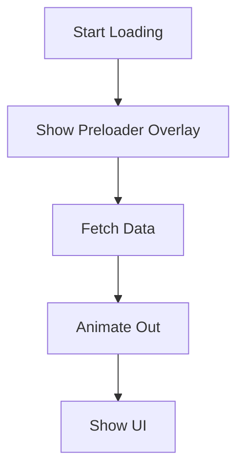

# 🚀 Фича: Красивый Прелоадер

## 1. Цель (Goal)
Создать современный, плавный и эстетичный прелоадер для CRM, который будет отображаться при загрузке данных или переключении между модулями. Это улучшит субъективное восприятие скорости работы системы и добавит "лоска".

## 2. Требования (Requirements)
- [ ] Плавные анимации (Framer Motion)
- [ ] Поддержка темной и светлой тем
- [ ] Соответствие цветовой палитре UI Kit
- [ ] Минимальное влияние на производительность

## 3. Технический стек (Stack)
- **Frontend**: Framer Motion, CSS Animations
- **Lib**: `@/components/ui/loader.tsx`

## 4. Схема реализации (Plan)

## ✅ План работ (Tasks)
- [ ] Исследование референсов (Apple-style, Glassmorphism) 📅 2026-04-01
- [ ] Создание базового компонента Loader 📅 2026-04-01
- [ ] Настройка анимаций появления/исчезновения
- [ ] Глобальная интеграция в Layour

---
[[050-Roadmap/Roadmap-Dashboard|Назад в Roadmap]]
