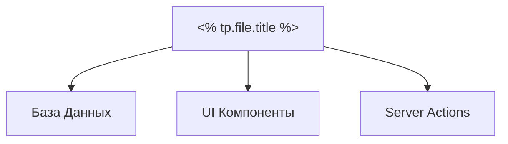

# 🧱 Модуль: <% tp.file.title %>

> [!NOTE]
> Этот модуль является частью основной архитектуры MerchCRM. 
> Стандарт реализации: [[010-Стандарты/Работа-с-Обсидианом|Obsidian Workflow v4.1]]

## 🎯 1. Цель (Goal)
Краткое описание бизнес-логики и ценности модуля.

## 📐 2. Архитектура (Architecture)
### Схема связей


### Модели данных (Prisma)
```prisma
// Опиши здесь основные поля модели
model <% tp.file.title %> {
  id        String   @id @default(cuid())
  createdAt DateTime @default(now())
  updatedAt DateTime @updatedAt
}
```

## 📋 3. Требования (Requirements)
- [ ] Функционал А
- [ ] Функционал Б
- [ ] Граничный случай В

## 🛠️ 4. Технический Стек (Tech Stack)
- **Frontend:** Next.js (Client Component), [[010-Стандарты/UI-UX-Pro-Max|Lumin-Style]]
- **Backend:** [[010-Стандарты/Actions|Server Actions]], Prisma ORM
- **Validations:** Zod schema

## ✅ Задачи (Tasks)
- [/] Спроектировать схему данных 📅 <% tp.date.now("YYYY-MM-DD", 0) %> 🔼
- [ ] Реализовать API / Server Actions 📅 <% tp.date.now("YYYY-MM-DD", 2) %> 🔼
- [ ] Сверстать UI компоненты 📅 <% tp.date.now("YYYY-MM-DD", 4) %>
- [ ] Покрыть тестами (Playwright) 📅 <% tp.date.now("YYYY-MM-DD", 6) %> 🔽

---
[[Merch-CRM|Назад к оглавлению]]
