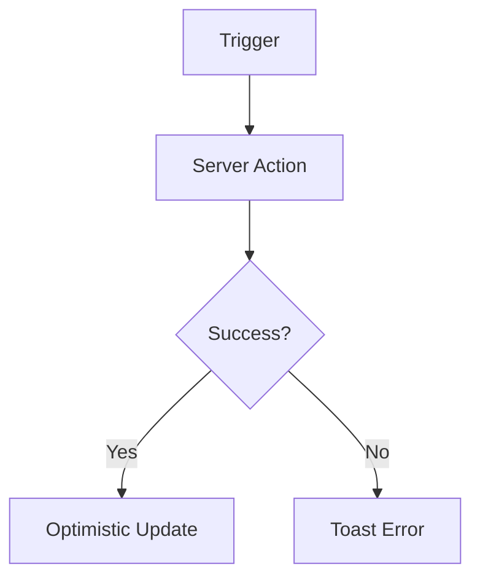

# 🚀 Фича: <% tp.file.title %>

## 1. Цель (Goal)
Опиши, какую проблему решает эта фича и какую пользу приносит пользователям CRM.

## 2. Требования (Requirements)
- [ ] Обязательное условие 1
- [ ] Обязательное условие 2
- [ ] Желаемое (Stretch goal)

## 3. Технический стек (Stack)
- **Frontend**: Components v2, Framer Motion
- **Backend**: Server Actions v3, Prisma / Drizzle
- **Lib**: `@/lib/session`, `@/lib/db`

## 4. Схема реализации (Plan)

## ✅ План работ (Tasks)
- [ ] Исследование и архитектурный набросок 📅 <% tp.date.now("YYYY-MM-DD") %> 🔼
- [ ] Реализация бизнес-логики (Server Actions) 📅 <% tp.date.now("YYYY-MM-DD", 2) %> 🔼
- [ ] Верстка UI и анимации 📅 <% tp.date.now("YYYY-MM-DD", 4) %>
- [ ] Тестирование и деплой 📅 <% tp.date.now("YYYY-MM-DD", 6) %> 🔽

---
[[060-Roadmap/Roadmap-Dashboard|Назад в Roadmap]]
